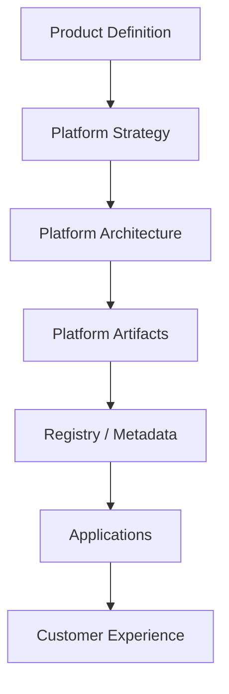

# 01_PLATFORM_INTELLIGENCE.md
### AIOS Platform Intelligence
**Version:** 1.0  
**Effective Date:** 2026-06-26  
**Status:** Active  
**Authority:** AIOS Platform Architecture

---

## Platform Overview

AIOS is the platform layer that governs how AI capabilities are defined, discovered, reviewed, and consumed. It is structured as a repository of intelligence artifacts rather than as a single application runtime.

This platform is designed to support:

- Multiple applications consuming shared AI capabilities
- Governance around Personas, Knowledge, Skills, and Workflows
- Metadata-driven discovery and registry generation
- Compatibility and lifecycle control for long-lived artifacts

---

## Repository Structure

The repository is organized into four primary domains:

- AIOS platform documents and standards
- Applications that consume the platform
- Shared assets for cross-application reuse
- Architectural decision records

High-level layout:

```text
AIOS/
  Foundation documents
  Personas/
  KnowledgeBase/
  Skills/
  Workflows/
  Registry/
  Templates/
  ADR/
Applications/
  Line_Chatbot_AI/
Shared/
ADR/
```

---

## Folder Convention

AIOS uses artifact-based folders rather than feature-based folders.

- Foundation documents remain at the AIOS root
- Personas live under Personas/
- Workflows live under Workflows/
- KnowledgeBase holds verified knowledge artifacts
- Skills hold reusable capabilities
- Registry holds registry and discovery artifacts
- ADR holds architecture decisions

This convention ensures that contributors can reason about AIOS by artifact type instead of by implementation file path.

---

## Naming Convention

AIOS uses a structured naming model:

- Personas: `10_Persona_[Role].md`
- Workflows: `20_Workflow_[Category]_[Name].md`
- Knowledge Base: `30_KB_[Category]_[Name].md`
- Skills: `40_Skill_[Category]_[Name].md`
- Templates: `50_Template_[Type]_[Name].md`
- Registry: `90_Registry_[Application|Artifact].md`
- ADRs: `ADR-XXXX-[ShortTitle].md`

The naming convention is part of the platform contract. It improves automability and maintainability.

---

## Architecture Overview

AIOS is a layered intelligence architecture:



The central idea is that product direction informs platform design, and platform design produces reusable artifacts that applications can consume.

---

## Repository Philosophy

The repository philosophy is platform-first:

- AIOS contains the single source of truth for shared intelligence assets
- Applications consume AIOS; they do not own AIOS
- Boundaries between platform and application are explicit
- Metadata and governance are first-class concerns
- Changes should be governed and traceable

This protects the platform from becoming a copy-paste dependency inside application folders.

---

## Platform Components

### Foundation Documents
The root AIOS documents establish the system's mission, principles, governance, and architecture standards.

Key examples:

- Vision
- Principles
- Constitution
- Context framework
- Decision framework
- Architecture audit
- Registry standard
- Repository convention
- Product architecture

### Personas
Personas define role, scope, tone, and decision boundaries. They are not domain knowledge themselves.

### Knowledge
Knowledge documents store verified facts, policies, and domain information. They are treated as durable and reviewable assets.

### Skills
Skills represent reusable capabilities. They should be atomic and composable.

### Workflows
Workflows orchestrate sequences of steps across Personas, Skills, and Knowledge.

### Registry
The Registry is the discovery and governance index for AIOS artifacts. It is designed to support routing, status awareness, and future automation.

### Metadata
Metadata is the platform contract that makes AIOS discoverable and governable. The metadata-first model is central to future automation and runtime integration.

---

## Runtime Model

AIOS is not a runtime by itself. It is the intelligence layer that informs runtime behavior.

In practice, runtimes such as applications, orchestrators, or agent systems consume AIOS artifacts through:

- artifact selection
- metadata inspection
- governance validation
- compatibility checks
- routing decisions

The platform is therefore both content and operating contract.

---

## Governance

Governance is embedded in the platform model.

The repository defines:

- Review requirements
- Audit expectations
- Approval boundaries
- Lifecycle rules
- Release policy
- Compatibility expectations

The governing principle is that platform changes should be traceable, reviewable, and aligned with product direction.

---

## Versioning and Release Strategy

The platform uses semantic-style versioning and explicit release planning.

- Patch: corrective or metadata changes
- Minor: backward-compatible capability addition
- Major: breaking changes or structural shifts

Release notes, compatibility guidance, and changelog practices are expected for platform evolution.

---

## Contribution Model

Contributors should work in the following flow:

1. Understand platform context
2. Identify the artifact type to modify or create
3. Follow AIOS naming and folder conventions
4. Populate governance and metadata where required
5. Review against principles and architecture boundaries
6. Publish through the appropriate platform lifecycle

The repository is designed so that new contributions can be understood by both humans and future AI systems.

---

## Dependency Model

AIOS artifacts depend on each other through explicit relationships:

- Personas depend on Principles and Knowledge
- Workflows depend on Personas and Skills
- Skills depend on Knowledge and standards
- Registry depends on artifact metadata and lifecycle state
- Applications depend on platform contracts rather than internal platform implementation

The system assumes that dependencies are documented and auditable.

---

## Platform Lifecycle

The repository describes a platform lifecycle with these stages:

- Discover
- Design
- Build
- Review
- Release
- Operate
- Evolve

This lifecycle is important because it prevents AIOS from being treated as a static document set.

---

## Platform Boundaries

### AIOS owns
- platform standards
- governance model
- shared intelligence artifacts
- artifact conventions
- metadata and registry design

### Applications own
- channel-specific execution
- business logic tied to a specific app
- UI and integration details
- application-specific routing behavior

The boundaries must remain clear to avoid architectural drift.

---

## Best Practices

- Read higher-level governance documents before implementation details
- Preserve artifact boundaries
- Keep application code separate from platform artifacts
- Treat metadata as a first-class contract
- Make assumptions explicit
- Prefer governable structure over convenience shortcuts

---

## Common Mistakes

- Embedding product decisions into architecture documents
- Duplicating AIOS artifacts inside applications
- Creating platform documents without governance context
- Treating the Registry as hand-authored content instead of a generated output
- Allowing application-specific behavior to become the de facto platform standard

---

## Future Platform Evolution

The future platform roadmap is already implied by the repository:

- stronger metadata automation
- richer registry-driven orchestration
- more reusable capabilities and adapters
- tighter compatibility management
- better developer tooling and consumption patterns

Future AI systems should understand that AIOS is meant to grow without redesign.

---

## AI Context Loading Protocol

Future AI assistants should load repository context in the following order:

The official entry point is AI_CONTEXT.md. The protocol then expands through 00_PRODUCT_INTELLIGENCE.md, 01_PLATFORM_INTELLIGENCE.md, 02_APPLICATION_INTELLIGENCE.md, 03_CURRENT_STATUS.md, and 90_AI_HANDOFF.md for active collaboration. This preserves the minimal-context principle while allowing escalation when the task requires deeper understanding.

Step 1 — Load 00_PRODUCT_INTELLIGENCE.md

Step 2 — Load 01_PLATFORM_INTELLIGENCE.md

Step 3 — Load 02_APPLICATION_INTELLIGENCE.md

Step 4 — Load 03_CURRENT_STATUS.md

Step 5 — Begin implementation

### Why this order works

This order minimizes context loss because it first establishes the product intent, then the platform architecture, then the application context, and finally the current operational state. It reduces the risk that an AI assistant will solve the wrong problem, misunderstand the ownership model, or bypass the platform boundaries.

It also maximizes architectural consistency by ensuring that implementation choices are grounded in product direction, platform standards, and current repository reality.
