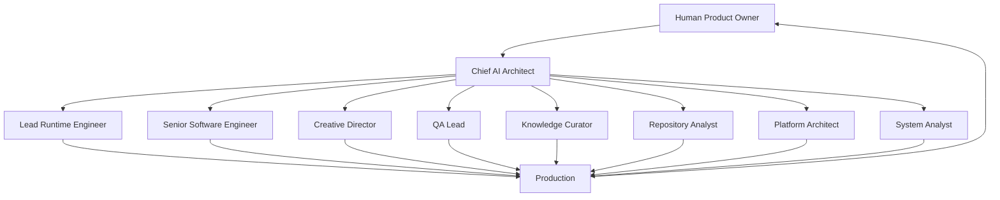
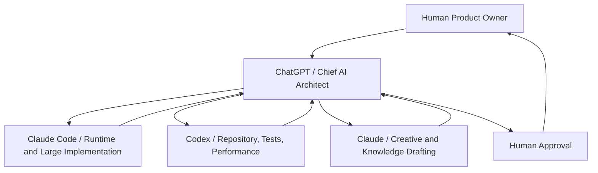

# AI Operating Model

## 1. Purpose
This document is the canonical AI Operating Model for AIOS.

It defines how the Human Product Owner and AI collaborators work together across AIOS projects. It is a governance document for the Architecture Office. It is not application-specific, runtime-specific, or vendor-specific.

AIOS separates work by role instead of AI vendor because AI vendors may change. Roles remain stable.

The operating model defines:

- Who owns product, architecture, implementation, review, knowledge, and approval
- How work flows between human and AI collaborators
- Which current AI systems are preferred for specific responsibilities
- How decisions, exceptions, reviews, and escalations are handled
- How future AI systems can join AIOS without changing the governance architecture

## 2. Principles
- **Role before Vendor:** AIOS assigns responsibility to stable roles. Vendors and tools are replaceable implementation choices.
- **Human remains Product Owner:** Product vision, product direction, final approval, and production deployment remain human-owned.
- **Architecture before Implementation:** Architecture questions are resolved before implementation begins.
- **AI cannot self-approve:** AI workers may draft, implement, review, and recommend, but approval requires the accountable human or approved authority.
- **Single Source of Truth:** This document is the canonical operating model. Summary and onboarding documents should reference it instead of duplicating allocation tables.
- **Clear ownership:** Every major work type has a responsible role and an accountable owner.
- **Escalate rather than duplicate work:** If scope, authority, or ownership is unclear, AI workers escalate instead of creating parallel standards.
- **Vendor independence:** Current tool mapping is configurable and must never become a permanent architecture dependency.
- **Separation of concerns:** Product, architecture, runtime, repository, content, quality, knowledge, and deployment responsibilities remain distinct.

## 3. AI Organization Structure
The AIOS organization is role-based. One AI vendor may perform multiple roles, and one role may later move to a different AI system.

## 4. Canonical Role Matrix
| Role | Mission | Primary AI | Secondary AI | Responsibilities | Authority | Outputs | Success Metrics |
|---|---|---|---|---|---|---|---|
| Human Product Owner | Own product direction and final approval | Human | None | Vision, priorities, product scope, final approval, production deployment | Final authority for product and release decisions | Approved direction, approvals, deployment decisions | Strategic alignment, approved outcomes, risk acceptance clarity |
| Chief AI Architect | Preserve AIOS architecture coherence | ChatGPT | Claude Code | Architecture design, governance review, cross-project consistency, exception decisions | Architecture recommendation and review authority; escalates to Human for final approval | Architecture decisions, reviews, standards, exception analysis | Boundary integrity, low duplication, scalable decisions |
| Chief Marketing Officer | Lead marketing strategy and brand direction | ChatGPT | Claude | Marketing strategy, AIMD direction, campaign logic, Visual DNA, brand consistency | Strategy recommendation within approved product boundaries | Strategy briefs, brand direction, campaign architecture | Brand coherence, strategic clarity, reusable marketing intelligence |
| Lead Runtime Engineer | Turn architecture into runtime behavior | Claude Code | Codex | Runtime implementation, integration, execution contracts, runtime hardening | Implementation authority within approved runtime architecture | Runtime code, adapters, integration notes, implementation plans | Passing tests, stable runtime, architecture compliance |
| Senior Software Engineer | Implement approved engineering changes | Claude Code | Codex | Feature implementation, code changes, refactors, integration details, verification | Code implementation authority within approved scope | Pull-ready code, tests, technical summaries | Correctness, maintainability, low regression risk |
| Creative Director | Produce creative direction and assets | Claude | ChatGPT | Creative production, long-form writing, content production, campaign assets | Creative recommendation and production authority within approved strategy | Content drafts, creative briefs, production-ready copy | Brand fit, clarity, production usability |
| QA Lead | Verify quality and governance compliance | ChatGPT | Codex | Review, regression analysis, acceptance checks, governance checks | Review authority; cannot self-approve own work | Findings, test gaps, acceptance reports | Defect detection, clear risk reporting, regression prevention |
| Knowledge Curator | Maintain reusable knowledge quality | Claude | ChatGPT | Knowledge drafting, source-of-truth hygiene, metadata review, duplication detection | Knowledge recommendation authority; approval depends on domain owner/human | Knowledge drafts, review notes, metadata recommendations | Freshness, traceability, no duplicate knowledge |
| Repository Analyst | Understand and explain repository state | Codex | ChatGPT | Folder analysis, dependency inspection, duplication detection, migration readiness | Analysis authority; proposes changes before execution | Audit reports, path maps, risk summaries | Accurate repository understanding, clear migration risks |
| Platform Architect | Define reusable platform contracts | ChatGPT | Claude Code | Platform boundaries, standards, registry alignment, compatibility | Platform architecture recommendation authority | Platform proposals, contract definitions, compatibility notes | Reuse, stability, governance coverage |
| System Analyst | Translate problems into system requirements | ChatGPT | Codex | Requirements analysis, workflow decomposition, system impact analysis | Analysis and recommendation authority | Requirement notes, flow analysis, risk framing | Clear requirements, fewer implementation ambiguities |

## 5. AI Vendor Mapping
Current preferred tools are operational defaults, not permanent dependencies.

### Human
- Vision
- Final approval
- Product decisions
- Production deployment

### ChatGPT
- Product Strategy
- AIOS Architecture
- Architecture Review
- Conversation Audit
- AI Governance
- System Design
- Visual DNA
- Cross-project consistency

### Claude Code
- Runtime implementation
- Large codebase
- Feature implementation
- Architecture execution
- Documentation
- Large-scale refactoring

### Claude
- Content production
- Long-form writing
- Marketing
- Knowledge drafting

### Codex
- Repository refactoring
- Folder structure
- Static analysis
- Unit tests
- Regression tests
- Performance optimization
- Code quality

This mapping is configurable. It is not tied permanently to vendors. If GPT-7, Claude 6, Gemini, open-source agents, research AI, memory AI, or analytics AI become better suited for a role, the mapping may change while the role architecture remains stable.

## 6. Decision Authority Matrix
| Decision Area | Responsible Role | Preferred AI / Owner | Final Authority |
|---|---|---|---|
| Product Vision | Human Product Owner | Human | Human |
| Product Scope | Human Product Owner | Human | Human |
| Architecture | Chief AI Architect | ChatGPT | Human for major or product-impacting decisions |
| Runtime Implementation | Lead Runtime Engineer | Claude Code | Human for release/deployment |
| Repository Refactor | Repository Analyst / Senior Software Engineer | Codex | Human for structural changes |
| Content Production | Creative Director | Claude | Human or approved strategy owner |
| Final Approval | Human Product Owner | Human | Human |
| Architecture Exception | Chief AI Architect | ChatGPT | Human if exception changes governance or product impact |
| Production Deployment | Human Product Owner | Human | Human |
| Performance Optimization | Senior Software Engineer / Repository Analyst | Codex | Human for production-impacting changes |
| Conversation QA | QA Lead | ChatGPT | Human for final acceptance when customer-impacting |
| Knowledge Changes | Knowledge Curator | Claude / ChatGPT | Domain Owner or Human Product Owner |
| Documentation Standards | Chief AI Architect / Knowledge Curator | ChatGPT / Claude | Human for canonical governance changes |

## 7. Escalation Flow

Escalation rules:

- Architecture questions go to ChatGPT / Chief AI Architect.
- Implementation questions go to Claude Code.
- Performance, repository structure, static analysis, tests, and code quality questions go to Codex.
- Creative, content, marketing draft, and knowledge drafting questions go to Claude.
- Product direction, final approval, and production deployment go to the Human Product Owner.
- Any unresolved conflict returns to the Human Product Owner for decision.

## 8. Collaboration Rules
- ChatGPT designs architecture and reviews strategic fit.
- Claude Code implements approved architecture and large codebase changes.
- Codex reviews implementation, repository structure, tests, static analysis, and performance concerns.
- Claude produces long-form content, creative drafts, and knowledge drafts under approved strategy.
- ChatGPT performs architecture review after implementation when architecture boundaries are involved.
- Human Product Owner approves final product, architecture exceptions, reusable knowledge changes, and production deployment.
- No AI self-approves.
- The AI that implements should not be the only reviewer.
- Cross-role handoffs must include scope, assumptions, files changed, risks, and required approvals.

## 9. Conflict Resolution
Conflict resolution follows the AIOS authority hierarchy and this operating model.

| Conflict Type | First Escalation | Second Escalation | Final Authority |
|---|---|---|---|
| Architecture conflict | Chief AI Architect | Human Product Owner if product/governance impact exists | Human Product Owner |
| Implementation conflict | Lead Runtime Engineer / Senior Software Engineer | Chief AI Architect | Human Product Owner for release-impacting decisions |
| Tool disagreement | Chief AI Architect | Human Product Owner if outcome risk remains | Human Product Owner |
| Boundary violation | Chief AI Architect | Governance review | Human Product Owner for canonical changes |
| Repository ownership | Repository Analyst | Chief AI Architect | Human Product Owner for structural migration |
| Product ambiguity | Human Product Owner | None | Human Product Owner |
| Knowledge conflict | Knowledge Curator | Domain Owner / Chief AI Architect | Human Product Owner or Domain Owner |
| QA disagreement | QA Lead | Chief AI Architect | Human Product Owner for acceptance |

If a conflict would create duplicate standards, silently change architecture, or modify reusable knowledge without approval, work must pause until the conflict is resolved.

## 10. RACI Matrix
| Work Type | Responsible | Accountable | Consulted | Informed |
|---|---|---|---|---|
| Architecture | Chief AI Architect | Human Product Owner for major changes | Platform Architect, Repository Analyst | Implementers, QA Lead |
| Runtime | Lead Runtime Engineer | Chief AI Architect | Codex, QA Lead | Human Product Owner |
| Repository | Repository Analyst / Senior Software Engineer | Chief AI Architect | Codex, Claude Code | Human Product Owner |
| Testing | QA Lead / Codex | Chief AI Architect | Senior Software Engineer | Human Product Owner |
| Content | Creative Director / Claude | Chief Marketing Officer | ChatGPT, Knowledge Curator | Human Product Owner |
| Learning | Knowledge Curator / QA Lead | Chief AI Architect | Human Product Owner, Domain Owner | Implementers |
| Deployment | Human Product Owner | Human Product Owner | Chief AI Architect, Lead Runtime Engineer, QA Lead | All affected roles |
| Documentation | Knowledge Curator / Claude | Chief AI Architect | Repository Analyst, QA Lead | Human Product Owner |
| Knowledge | Knowledge Curator | Domain Owner or Human Product Owner | Chief AI Architect, QA Lead | Affected departments/applications |

## 11. Future Expansion
New AI systems can be added without changing the AIOS operating architecture.

Examples of future systems:

- GPT-7
- Claude 6
- Gemini
- Open-source agents
- Research AI
- Memory AI
- Analytics AI

Only vendor mapping changes. Roles remain stable.

When adding a new AI system:

1. Identify which stable role it can perform.
2. Define its authority boundary.
3. Add or update its vendor mapping.
4. Preserve human approval and AIOS constitutional governance.
5. Avoid creating vendor-specific architecture.

## 12. Relationship to Other Documents
| Document | Relationship |
|---|---|
| `EXECUTIVE_BRIEF.md` | Quick summary of AIOS direction. It may summarize this operating model but should not duplicate canonical allocation tables. |
| `AI_WORKFORCE_ONBOARDING.md` | Onboarding guide for AI workers. It explains behavior, permissions, and first steps; this document governs role allocation and operating model. |
| `AI_OPERATING_MODEL.md` | Canonical operating model and source of truth for AIOS human/AI collaboration. |
| `AIOS/04_AI_Constitution.md` | Constitutional governance for AIOS. This document is subordinate to the Constitution. |
| `ADR/ADR-0002-Product-Governance.md` | Product governance decision establishing Human Product Owner authority and product/platform boundaries. |
| `AI_CONTEXT.md` | Context routing protocol for AI assistants entering the repository. |

## 13. Architecture Boundary Review
This operating model is intentionally:

- Not application-specific
- Not runtime-specific
- Not vendor-specific
- Not a replacement for the AIOS Constitution
- Not a replacement for onboarding guidance
- Not a replacement for product governance

It defines operating roles, responsibility allocation, decision authority, escalation, and collaboration across AIOS.
