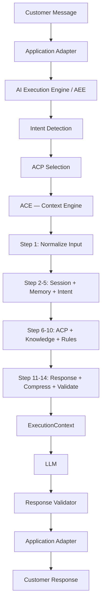

# 01 — Context Engine Overview

**Document ID**: AIOS-ACE-01  
**Version**: 1.0  
**Status**: Active  
**Last Updated**: 2026-06-27

---

## What Is ACE?

The AI Context Engine (ACE) is the **kernel** of the AIOS platform. It is the single component responsible for deciding exactly what information the LLM receives before generating a response.

Every intelligent response the AIOS system produces flows through ACE. Without ACE, the AI Execution Engine would either flood the LLM with irrelevant information or starve it of critical decision-making context.

---

## Why ACE Exists

### The Problem Without ACE

Without a dedicated context orchestration layer, AI systems suffer predictable failure modes:

| Problem | Symptom | Root Cause |
|---|---|---|
| Context flooding | LLM ignores critical constraints because they're buried | No prioritization of context |
| Context starvation | LLM gives generic responses because no relevant knowledge loaded | No intent-driven context selection |
| Inconsistent behavior | Same question gets different quality answers | No deterministic context assembly |
| Trust rule violation | LLM asks for phone during trust concern | No pre-flight validation |
| Medical overconfidence | LLM guarantees insurance approval | No restriction enforcement before LLM call |
| Re-asking known fields | LLM asks for name again after customer said it | No memory resolution before LLM call |

### ACE's Solution

ACE solves these by making context assembly a **deterministic, validated, auditable process** rather than an implicit, prompt-level concern.

---

## How ACE Differs from Prompt Engineering

| Dimension | Prompt Engineering | ACE |
|---|---|---|
| Scope | Hardcoded instructions in one prompt | Dynamic assembly from multiple authoritative sources |
| Adaptability | Changed by editing prompt text | Changed by updating ACP, Knowledge, or Dataset documents |
| Traceability | Unknown which instruction governed the response | Every context fragment is sourced and logged |
| Testability | Hard to isolate which instruction failed | Each assembly step is independently testable |
| Maintenance | One large fragile text blob | Modular, versioned documents |
| Scale | Degrades as complexity grows | Designed for complexity |

ACE does not replace prompts — it generates better-structured input to the LLM than static prompts can provide.

---

## How ACE Differs from a Knowledge Base

| Dimension | Knowledge Base | ACE |
|---|---|---|
| Stores facts | YES | NO |
| Selects facts | NO | YES |
| Builds context | NO | YES |
| Enforces restrictions | NO | YES |
| Validates safety | NO | YES |
| Produces LLM input | NO | YES |

ACE consumes knowledge bases; it does not replace them.

---

## How ACE Works with AEE and ACP

### ACE's Relationship with AEE

The AI Execution Engine (AEE) is responsible for intent detection and ACP selection. Once it selects a capability (e.g., ACP-08 TRUST_ADVISOR), it hands control to ACE.

ACE's job begins after ACP selection. It reads the selected ACP's specification, then assembles the full context the LLM needs to execute that capability correctly.

### ACE's Relationship with ACP

ACE does not contain capability logic. It reads ACP documents to understand:
- What knowledge to load
- What memory to check
- What restrictions to enforce
- What response profile to apply
- What decision rules to summarize

ACE selects relevant **fragments** from ACP — it never copies the entire package into context.

---

## ACE Design Principles

**1. Minimal Sufficient Context**: Include only what is needed for this conversation turn. No irrelevant documents. No background loading.

**2. Deterministic Assembly**: Given the same intent, session state, and ACP, ACE always produces a structurally equivalent context. Responses may vary; context structure does not.

**3. Restriction-First**: Restrictions from ACP are resolved and placed in context BEFORE knowledge. The LLM sees what it cannot do before it sees what it could do.

**4. Trust-Safe Assembly**: If trust concern is detected, ACE places lead capture restriction in context regardless of what other capabilities are active.

**5. Audit-Ready**: Every context assembled by ACE is loggable. Every decision about what was included and excluded can be explained.

---

## ACE Scope Summary

**ACE owns**: Context selection, assembly, compression, validation  
**ACE does not own**: Knowledge, rules, dataset content, channel logic, LLM calls

---

## Version History

| Version | Date | Change |
|---|---|---|
| 1.0 | 2026-06-27 | Initial release |
