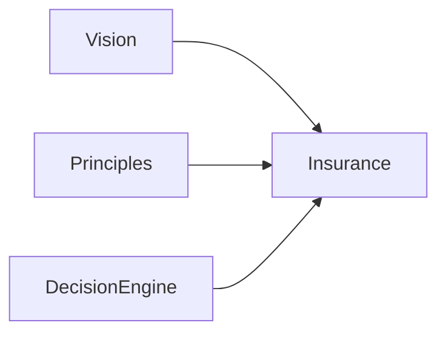

# 1. Insurance Domain

### Metadata
- Version: 1.0
- Effective Date: 2026-06-26
- Status: Active
- Authority: AIOS Domain Lead

## 1. Purpose
This folder contains domain-specific business knowledge and behavior for the Insurance domain. It is Layer 2 in AIOS and must not change AIOS Core.

## 2. Scope
Business knowledge, decision rules, trust & fraud, sales processes, lead models, products, and regulatory knowledge relevant to insurance.

## 3. Relationship with Parent Layer
- Parent: AIOS Core (Vision, Principles, Conversation Intelligence, Decision Engine)
- Relationship: Domain artifacts adapt core AIOS capabilities for insurance use-cases.

## 4. Dependencies
- AIOS Core: Vision, Principles, Conversation Intelligence, Decision Engine

## 5. Future Improvements
- Add structured decision rules and test scenarios

