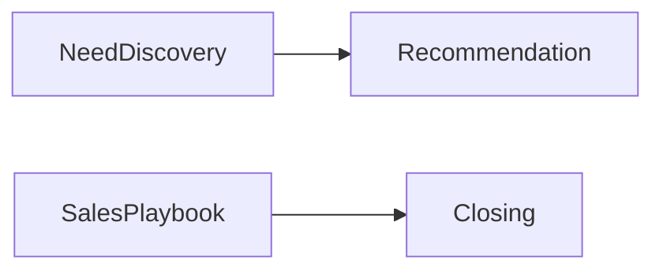

# 1. Sales

### Metadata
- Version: 1.0
- Effective Date: 2026-06-26

## 1. Purpose
Sales playbooks and processes for the Insurance domain.

## 2. Scope
Need discovery, consultative selling, closing frameworks, and cross-sell strategies.

## 3. Relationship with Parent Layer
Depends on Vision, Principles, Conversation Intelligence, and Decision Engine for permitted tactics.

## 4. Future Improvements
- Add structured sales scripts and A/B testing scenarios

