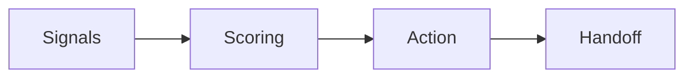

# 1. Trust Engine

### Metadata
- Version: 1.0
- Effective Date: 2026-06-26
- Status: Draft
- Authority: Domain Trust Owner

## 1. Purpose
Define the Trust Engine that evaluates signals to compute a customer trust score and recommended actions.

## 2. Scope
Signal ingestion, scoring rules, thresholding, escalation, and human handoff triggers.

## 3. Inputs
- Behavioral signals
- Identity verification results
- Transaction patterns

## 4. Outputs
- Trust score
- Recommended action (auto-approve, require human, block)

## 5. Dependencies
- Decision Engine
- Conversation Intelligence
- External verification services

## 6. Future Improvements
- ML-backed scoring
- Explainability logs

