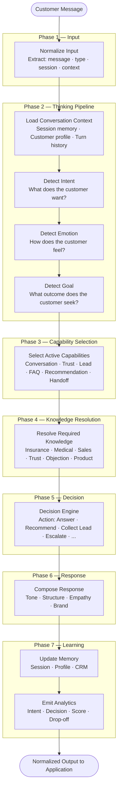

# 01 — Execution Overview
### AI Execution Engine — End-to-End Processing Flow
**Version:** 1.0
**Effective Date:** 2026-06-26
**Status:** Active
**Authority:** Chief AI System Architect

---

## Purpose

Define the complete end-to-end flow of how AIOS processes one customer message — from raw input through thinking, decision, response, and learning. This document is the conceptual entry point for understanding the AI Execution Engine.

---

## Scope

This document covers:
- The seven phases of AIOS execution
- The role of each phase
- The data that flows between phases
- The high-level Mermaid diagram of the full pipeline

This document does not cover:
- Step-by-step implementation of each phase (see `02_EXECUTION_PIPELINE.md`)
- Capability selection logic (see `03_CAPABILITY_LOADER.md`)
- Knowledge resolution logic (see `04_KNOWLEDGE_RESOLVER.md`)
- Response generation rules (see `06_RESPONSE_COMPOSER.md`)

---

## The Seven Phases of AIOS Execution



---

## Phase 1 — Input

The engine receives a **normalized ExecutionInput** from an Application Adapter. The adapter is responsible for translating channel-specific events (webhook payload, voice transcript, form submission) into the standard input format.

At this phase, the engine knows:
- The message text or intent signal
- The message type (text, postback, event, media)
- The session identifier
- The customer identifier
- The domain (e.g., INSURANCE)
- The language
- The channel type (CHAT, VOICE, EMAIL)

The engine does NOT know which application sent it, what UI is rendering the response, or which AI model will generate text.

---

## Phase 2 — Thinking Pipeline

The thinking pipeline transforms raw input into a structured understanding of the customer's state. Three analyses run in sequence because each depends on the prior:

**Conversation Context** is loaded first. Without context, intent detection operates on a single message in isolation and will misclassify follow-up messages. Context provides the prior turns, the current lead state, the active conversation mode, and the customer's emotional history.

**Intent Detection** classifies what the customer is trying to accomplish. Intent is not a keyword match — it is a classification of the customer's goal within the conversation context. The same words may signal different intents in different contexts.

**Emotion Detection** classifies the emotional register of the message. Anger, confusion, fear, interest, and trust have different implications for capability selection and response composition. Emotion is detected after intent because some emotional signals are context-dependent (e.g., "I don't understand" is confused only if the preceding turn was an explanation).

**Goal Detection** infers what outcome the customer is ultimately seeking, which may differ from their stated request. A customer asking "is this product safe?" may have an underlying goal of reassurance rather than information. Goal detection informs the Decision Engine about what would constitute a successful response.

---

## Phase 3 — Capability Selection

Based on the intent, emotion, goal, and current conversation state, the Capability Loader selects which capabilities to activate for this turn. Capabilities are not all loaded for every message — only those relevant to the current context.

A conversational FAQ question activates FAQ Engine. A customer expressing fraud concern activates Trust Engine. A customer with declared health conditions activates Lead Engine and may activate Handoff Engine. Capability composition is dynamic.

See `03_CAPABILITY_LOADER.md` for the full capability registry and selection rules.

---

## Phase 4 — Knowledge Resolution

The Knowledge Resolver identifies which domain knowledge is needed to execute the selected capabilities. Not all domain knowledge is loaded for every message.

An insurance question about cancer coverage activates Medical Knowledge and Product Knowledge. A tax question activates Tax Knowledge. A closing scenario activates Sales Playbook. Knowledge is resolved by domain, topic, and the active capabilities.

See `04_KNOWLEDGE_RESOLVER.md` for resolution rules and priority handling.

---

## Phase 5 — Decision

The Decision Engine produces a single Action from a defined action set. Actions are:

`ANSWER` · `ANSWER_THEN_ASK` · `BUILD_TRUST` · `RECOMMEND` · `COLLECT_LEAD` · `ESCALATE_HUMAN` · `WAIT` · `SUMMARIZE` · `END_CONVERSATION`

The decision is **deterministic** — given the same ExecutionContext (intent + emotion + goal + trust score + lead state + conversation history), the Decision Engine always produces the same action. There is no randomness or model-dependent choice at the decision layer.

See `05_DECISION_PIPELINE.md` for the full decision logic.

---

## Phase 6 — Response

The Response Composer generates the structured response content based on the Decision, the resolved knowledge, and the active tone rules. The composer outputs normalized response objects — not channel-specific formats.

The Application Adapter translates normalized responses into channel-specific format (Flex Message, voice TTS, web markdown, etc.).

See `06_RESPONSE_COMPOSER.md` for tone, structure, and composition rules.

---

## Phase 7 — Learning

After the response is composed, the engine updates memory and emits analytics events. These happen after the response is ready — they never block response delivery.

**Memory Update** writes to the appropriate memory layer: working memory expires, session memory persists for the current conversation, customer profile updates persist to CRM memory.

**Analytics** records what happened: which intent was detected, which capability was used, what decision was made, what the conversation score is, and whether a drop-off risk was detected.

See `07_MEMORY_ENGINE.md` and `08_ANALYTICS_ENGINE.md` for full specifications.

---

## Data Object: ExecutionContext

The ExecutionContext is the internal state object that accumulates results across all phases. It begins at Phase 1 and is enriched at every subsequent phase. The Decision Engine and Response Composer read from it. Memory Update and Analytics write final values back to it.

```
ExecutionContext {
  input: ExecutionInput
  conversation_context: ConversationContext
  intent: IntentResult
  emotion: EmotionResult
  goal: GoalResult
  active_capabilities: Capability[]
  resolved_knowledge: KnowledgeBundle
  decision: Decision
  response: Response[]
  memory_updates: MemoryUpdate[]
  analytics_events: AnalyticsEvent[]
}
```

---

## Cross-Phase Failure Handling

If any phase fails, the engine must not produce an empty response. The failure policy:

| Phase | Failure | Fallback |
|---|---|---|
| Context load fails | Use empty context; treat as new conversation | |
| Intent detection fails | Default to `INTENT_UNKNOWN`; activate FAQ Engine | |
| Emotion detection fails | Default to `EMOTION_NEUTRAL` | |
| Capability load fails | Log error; use minimal ConversationIntelligence only | |
| Knowledge resolution fails | Log error; respond from available context only | |
| Decision Engine fails | Default to `COLLECT_LEAD` if lead incomplete, else `ANSWER` | |
| Response composition fails | Return predefined safe fallback response | |
| Memory update fails | Log error; do not block or retry; continue | |
| Analytics fails | Log error; do not block response | |

---

## Dependencies

- `AIOS/00_PRODUCT_INTELLIGENCE.md` — Vision alignment
- `AIOS/01_PLATFORM_INTELLIGENCE.md` — Platform governance
- `AIOS/Domains/Insurance/Domain_Contract.md` — Domain interface rules
- `AIOS/Execution/09_EXECUTION_CONTRACT.md` — Input/Output interfaces

---

## Version History

| Version | Date | Author | Change Description |
|---|---|---|---|
| 1.0 | 2026-06-26 | Chief AI System Architect | Initial creation — AIOS Phase 4 |
