# 02 — Execution Pipeline
### AI Execution Engine — Step-by-Step Pipeline Specification
**Version:** 1.0
**Effective Date:** 2026-06-26
**Status:** Active
**Authority:** Chief AI System Architect

---

## Purpose

Define every step of the AIOS execution pipeline with complete specifications for each step: purpose, inputs, outputs, dependencies, and failure handling. This document is the authoritative specification for pipeline implementors.

---

## Scope

This document covers the 11 pipeline steps from input receipt to analytics emission. Each step is defined as a discrete processing unit with clear input/output contracts.

This document does not cover:
- Capability internals (see `03_CAPABILITY_LOADER.md`)
- Knowledge resolution internals (see `04_KNOWLEDGE_RESOLVER.md`)
- Decision logic internals (see `05_DECISION_PIPELINE.md`)
- Response composition rules (see `06_RESPONSE_COMPOSER.md`)
- Memory layer internals (see `07_MEMORY_ENGINE.md`)
- Analytics internals (see `08_ANALYTICS_ENGINE.md`)

---

## Pipeline Overview

```mermaid
flowchart LR
    S1[Step 1\nReceive Input] --> S2[Step 2\nConversation Context]
    S2 --> S3[Step 3\nIntent Detection]
    S3 --> S4[Step 4\nEmotion Detection]
    S4 --> S5[Step 5\nGoal Detection]
    S5 --> S6[Step 6\nCapability Selection]
    S6 --> S7[Step 7\nKnowledge Resolution]
    S7 --> S8[Step 8\nDecision Engine]
    S8 --> S9[Step 9\nResponse Composer]
    S9 --> S10[Step 10\nMemory Update]
    S10 --> S11[Step 11\nAnalytics]
```



Steps 1–9 are synchronous (each must complete before the next begins). Steps 10 and 11 are post-response — they are triggered after the response is ready and do not block delivery.

---

## Step 1 — Receive Input

### Purpose
Accept the normalized ExecutionInput from the Application Adapter, validate its structure, and initialize the ExecutionContext that will carry state through all subsequent steps.

### Inputs
- `ExecutionInput` packet (see `09_EXECUTION_CONTRACT.md`)
- `message` — normalized text or semantic intent signal
- `message_type` — TEXT | POSTBACK | EVENT | MEDIA
- `session_id` — channel-agnostic identifier
- `customer_id` — channel-agnostic customer identifier
- `timestamp` — ISO-8601
- `application_context.domain` — e.g., INSURANCE
- `application_context.language` — e.g., th
- `application_context.channel_type` — CHAT | VOICE | EMAIL

### Outputs
- Initialized `ExecutionContext` with `input` populated
- Validated input confirmation or validation error

### Dependencies
- `09_EXECUTION_CONTRACT.md` — `ExecutionInput` schema

### Failure Handling
- If `session_id` or `customer_id` is missing: reject input; return `INPUT_VALIDATION_ERROR`
- If `message` is empty and `message_type` is TEXT: return `EMPTY_INPUT` error
- If `domain` is unknown: return `UNKNOWN_DOMAIN` error
- If timestamp is malformed: substitute server-time; log warning

---

## Step 2 — Conversation Context

### Purpose
Hydrate the ExecutionContext with everything the engine knows about the current conversation — prior turns, customer profile, active lead state, current conversation mode, and trust state. This transforms a single message into a contextually grounded conversation turn.

### Inputs
- `session_id` from ExecutionContext
- `customer_id` from ExecutionContext
- Session Memory store (from `07_MEMORY_ENGINE.md` → Session Layer)
- Customer Profile store (from `07_MEMORY_ENGINE.md` → Profile Layer)
- CRM Memory (if customer is a returning lead)

### Outputs
- `ConversationContext` added to ExecutionContext containing:
  - `prior_turns[]` — last N turns (text, intent, decision, response summary)
  - `current_mode` — GREETING | FAQ | LEAD_CAPTURE | PRODUCT | CLOSING | HANDOFF
  - `customer_profile` — all known lead fields (from `Lead_Data_Model.md`)
  - `lead_state` — current lead_status and lead_score
  - `trust_state` — current trust score and trust signals
  - `session_turn_count` — how many turns in this session
  - `is_returning_customer` — boolean

### Dependencies
- `07_MEMORY_ENGINE.md` — Session and Profile memory layers
- `AIOS/Domains/Insurance/Lead/Lead_Data_Model.md` — customer profile field schema
- `AIOS/Domains/Insurance/Trust/Trust_Engine.md` — trust state definition

### Failure Handling
- If session memory is unavailable: initialize empty context; set `is_returning_customer=false`; log warning
- If customer profile is unavailable: use empty profile; flag `profile_load_failed=true`
- Never block execution on context hydration failure — proceed with empty context

---

## Step 3 — Intent Detection

### Purpose
Classify what the customer is trying to accomplish in this turn, interpreted within conversation context. Intent is the primary signal that drives capability selection and decision making.

### Inputs
- `message` from ExecutionInput
- `message_type` from ExecutionInput
- `ConversationContext.prior_turns` — for contextual disambiguation
- `ConversationContext.current_mode` — restricts feasible intent space
- Domain intent taxonomy (loaded from domain configuration)

### Outputs
- `IntentResult` added to ExecutionContext:
  - `primary_intent` — top-ranked intent from taxonomy
  - `secondary_intent?` — second-ranked intent if confidence gap is small
  - `intent_confidence` — float 0.0–1.0
  - `intent_source` — POSTBACK | KEYWORD | SEMANTIC | CONTEXTUAL
  - `raw_signal` — extracted signals (keywords, patterns) that contributed

### Insurance Domain Intent Taxonomy

| Intent Category | Intents |
|---|---|
| Information | `INTENT_FAQ` · `INTENT_PRODUCT_INFO` · `INTENT_CLAIM_INFO` · `INTENT_TAX_INFO` |
| Purchase | `INTENT_GET_QUOTE` · `INTENT_APPLY` · `INTENT_COMPARE` |
| Trust | `INTENT_VERIFY_LEGITIMACY` · `INTENT_SCAM_CONCERN` · `INTENT_SKEPTICAL` |
| Lead | `INTENT_PROVIDE_INFO` · `INTENT_DECLINE_TO_SHARE` · `INTENT_RESUME_FLOW` |
| Handoff | `INTENT_REQUEST_HUMAN` · `INTENT_CALL_BACK` |
| Conversation | `INTENT_GREETING` · `INTENT_GOODBYE` · `INTENT_CHANGE_TOPIC` |
| Unknown | `INTENT_UNKNOWN` |

### Dependencies
- `ConversationContext` (from Step 2)
- Domain intent taxonomy (configured per domain)

### Failure Handling
- If classification confidence < 0.4: set `primary_intent=INTENT_UNKNOWN`; proceed
- If `INTENT_UNKNOWN`: activate FAQ Engine as default (safe fallback)
- Never block on intent detection failure

---

## Step 4 — Emotion Detection

### Purpose
Classify the emotional register of the customer's message within context. Emotion detection informs tone selection, empathy rules, and capability prioritization. A customer expressing fear activates Trust Engine. A customer expressing frustration modifies response tone.

### Inputs
- `message` from ExecutionInput
- `ConversationContext.prior_turns` — for emotional trajectory
- `IntentResult` — intent context aids emotion disambiguation

### Outputs
- `EmotionResult` added to ExecutionContext:
  - `primary_emotion` — NEUTRAL | CURIOUS | ANXIOUS | SKEPTICAL | FRUSTRATED | INTERESTED | TRUSTING | CONFUSED
  - `emotion_intensity` — LOW | MEDIUM | HIGH
  - `emotional_trajectory` — IMPROVING | STABLE | DECLINING (compared to prior turns)
  - `empathy_required` — boolean; true when anxiety/fear/frustration is HIGH

### Dependencies
- `ConversationContext` (from Step 2)
- `IntentResult` (from Step 3)

### Failure Handling
- If detection fails: default to `EMOTION_NEUTRAL` · `intensity=LOW`
- Never block execution

---

## Step 5 — Goal Detection

### Purpose
Infer the deeper outcome the customer is seeking — which may differ from their stated request. A customer asking "how does health insurance work?" may have an underlying goal of purchasing reassurance, not encyclopedic knowledge. Goal detection enables the engine to serve the customer's real need.

### Inputs
- `IntentResult` (from Step 3)
- `EmotionResult` (from Step 4)
- `ConversationContext` — full profile and prior turns
- Goal inference rules (configured per domain)

### Outputs
- `GoalResult` added to ExecutionContext:
  - `primary_goal` — UNDERSTAND | VERIFY | PURCHASE | AVOID_RISK | COMPARE | GET_HELP | BE_HEARD
  - `goal_confidence` — float 0.0–1.0
  - `unstated_need?` — inferred deeper need if different from stated request
  - `success_criteria` — what a successful response would accomplish for this customer

### Dependencies
- `IntentResult` (from Step 3)
- `EmotionResult` (from Step 4)
- `ConversationContext` (from Step 2)

### Failure Handling
- If goal cannot be inferred: derive from intent mapping (e.g., `INTENT_FAQ` → `GOAL_UNDERSTAND`)
- Default success criteria: customer question is answered

---

## Step 6 — Capability Selection

### Purpose
Dynamically select which capabilities to activate for this execution turn. Not all capabilities are loaded for every message. Capability selection is driven by intent, emotion, goal, lead state, and trust state.

### Inputs
- `IntentResult` (from Step 3)
- `EmotionResult` (from Step 4)
- `GoalResult` (from Step 5)
- `ConversationContext.lead_state`
- `ConversationContext.trust_state`
- Capability Registry (from `03_CAPABILITY_LOADER.md`)

### Outputs
- `active_capabilities[]` added to ExecutionContext — ordered list of selected capabilities
- Each capability entry includes: `capability_id`, `activation_reason`, `priority`

### Capability Selection Matrix (abbreviated)

| Condition | Capabilities Activated |
|---|---|
| `INTENT_FAQ` | ConversationIntelligence + FAQEngine |
| `INTENT_SCAM_CONCERN` or `EMOTION_SKEPTICAL` | TrustEngine (priority 1) + ConversationIntelligence |
| `INTENT_GET_QUOTE` | LeadEngine + RecommendationEngine + ConversationIntelligence |
| `INTENT_REQUEST_HUMAN` | HandoffEngine |
| `GOAL_PURCHASE` + `lead_status=qualified` | RecommendationEngine + LeadEngine + HandoffEngine |
| `EMOTION_ANXIOUS` HIGH | TrustEngine (priority 1) + ConversationIntelligence |
| Health condition disclosed | LeadEngine + FAQEngine (medical) |
| Objection detected | ObjectionEngine + TrustEngine |

Full selection rules: see `03_CAPABILITY_LOADER.md`.

### Dependencies
- Steps 3, 4, 5 — Intent, Emotion, Goal results
- `ConversationContext` (from Step 2)
- `03_CAPABILITY_LOADER.md` — Capability Registry and selection rules

### Failure Handling
- If capability registry unavailable: activate ConversationIntelligence only
- If a selected capability fails to load: remove from active list; log error; continue with remaining

---

## Step 7 — Knowledge Resolution

### Purpose
Resolve which domain knowledge sources are needed to serve the active capabilities. Only the relevant knowledge is loaded — not the entire knowledge base. Resolution is driven by intent, domain, active capabilities, and detected topic signals.

### Inputs
- `IntentResult` (from Step 3)
- `active_capabilities` (from Step 6)
- `application_context.domain` — e.g., INSURANCE
- Topic signals extracted in Step 3
- Knowledge Catalog (from `04_KNOWLEDGE_RESOLVER.md`)

### Outputs
- `KnowledgeBundle` added to ExecutionContext:
  - `resolved_sources[]` — list of resolved knowledge sources, each with: `source_id`, `domain`, `topic`, `relevance_score`
  - `primary_source` — highest-relevance source
  - `resolution_confidence` — float 0.0–1.0

### Dependencies
- `active_capabilities` (from Step 6)
- `IntentResult` (from Step 3)
- `04_KNOWLEDGE_RESOLVER.md` — Knowledge Catalog and resolution rules
- `AIOS/Domains/Insurance/` — Insurance domain knowledge (Layer 2)

### Failure Handling
- If primary source unavailable: use secondary source; log warning
- If no sources resolve: proceed with ConversationContext knowledge only; log error
- Never block on knowledge resolution failure

---

## Step 8 — Decision Engine

### Purpose
Produce a single, deterministic Action from the defined action set. The Decision Engine reads the full ExecutionContext (intent + emotion + goal + capabilities + knowledge + conversation history + lead state + trust state) and returns exactly one action.

### Inputs
- Full `ExecutionContext` at this point
- Decision rules (from `05_DECISION_PIPELINE.md`)

### Outputs
- `Decision` added to ExecutionContext:
  - `action` — one of: ANSWER | ANSWER_THEN_ASK | BUILD_TRUST | RECOMMEND | COLLECT_LEAD | ESCALATE_HUMAN | WAIT | SUMMARIZE | END_CONVERSATION
  - `action_rationale` — which rules triggered this action
  - `target_field?` — for COLLECT_LEAD: which field to collect next
  - `recommended_product?` — for RECOMMEND: which product to surface
  - `handoff_trigger?` — for ESCALATE_HUMAN: which escalation rule was met

### Dependencies
- Full `ExecutionContext` (all prior steps)
- `05_DECISION_PIPELINE.md` — Decision rules

### Failure Handling
- If decision rules produce no clear winner: apply default action:
  - If `INTENT_UNKNOWN` → `ANSWER` with clarifying question
  - If lead incomplete → `COLLECT_LEAD`
  - Otherwise → `ANSWER`

---

## Step 9 — Response Composer

### Purpose
Generate the normalized response content based on the Decision, resolved knowledge, tone rules, and brand alignment. The composer outputs structured response objects — not channel-specific formats.

### Inputs
- `Decision` (from Step 8)
- `KnowledgeBundle` (from Step 7)
- `ConversationContext` — customer name, relationship history, language
- `EmotionResult` — drives tone and empathy selection
- Response composition rules (from `06_RESPONSE_COMPOSER.md`)

### Outputs
- `Response[]` added to ExecutionContext — normalized response objects:
  - `response_type` — TEXT | STRUCTURED | QUESTION | SUMMARY | HANDOFF_MESSAGE
  - `content` — composed text (language-correct, tone-appropriate)
  - `follow_up_question?` — for ANSWER_THEN_ASK
  - `knowledge_source_ids[]` — which knowledge sources informed this response
  - `tone_applied` — INFORMATIVE | REASSURING | EMPATHETIC | PROFESSIONAL | CLOSING

### Dependencies
- `Decision` (from Step 8)
- `KnowledgeBundle` (from Step 7)
- `ConversationContext` (from Step 2)
- `EmotionResult` (from Step 4)
- `06_RESPONSE_COMPOSER.md` — Composition rules

### Failure Handling
- If knowledge source is empty: compose from context only; flag `knowledge_unavailable=true`
- If composition produces empty content: return predefined safe fallback text
- Never return an empty response to the Application Adapter

---

## Step 10 — Memory Update

### Purpose
Persist the results of this execution turn to the appropriate memory layers. Memory updates are asynchronous and must not block response delivery to the Application Adapter.

### Inputs
- Full `ExecutionContext`
- `Response[]` (from Step 9)

### Outputs
- `MemoryUpdate[]` — list of updates written to each memory layer:
  - Working memory: expires at end of turn
  - Session memory: updated with this turn's summary
  - Customer profile: updated with any new lead fields captured
  - CRM memory: updated if lead state changed or handoff triggered

### Dependencies
- `07_MEMORY_ENGINE.md` — Memory layer specifications
- `AIOS/Domains/Insurance/Lead/Lead_Data_Model.md` — Field definitions for profile update

### Failure Handling
- Memory update failures must be logged but must not block or retry synchronously
- Failed updates should be queued for replay by the Application Adapter's persistence layer

---

## Step 11 — Analytics

### Purpose
Emit structured analytics events for every meaningful occurrence in this execution turn. Analytics are the observability layer of the AEE. Nothing happens silently.

### Inputs
- Full `ExecutionContext`
- `MemoryUpdate[]` (from Step 10)

### Outputs
- `AnalyticsEvent[]` — structured events emitted to the Analytics Engine:
  - `INTENT_DETECTED` — intent, confidence, source
  - `EMOTION_DETECTED` — emotion, intensity, trajectory
  - `CAPABILITY_ACTIVATED` — which capabilities ran
  - `KNOWLEDGE_RESOLVED` — which sources were used
  - `DECISION_MADE` — action taken, rationale
  - `RESPONSE_COMPOSED` — response type, tone, length
  - `LEAD_UPDATED` — field captured, new lead score, status change
  - `TRUST_UPDATED` — trust score change
  - `HANDOFF_TRIGGERED` — escalation reason (if applicable)
  - `DROP_OFF_RISK` — if session signals suggest the customer may disengage

### Dependencies
- `08_ANALYTICS_ENGINE.md` — Event schema and routing

### Failure Handling
- Analytics failures must never block or affect response
- Failed events must be logged locally and flagged for retry

---

## Pipeline Timing Expectations

| Step | Expected Duration | Blocking |
|---|---|---|
| 1 — Receive Input | < 5ms | Yes |
| 2 — Conversation Context | < 50ms | Yes |
| 3 — Intent Detection | < 100ms | Yes |
| 4 — Emotion Detection | < 50ms | Yes |
| 5 — Goal Detection | < 30ms | Yes |
| 6 — Capability Selection | < 20ms | Yes |
| 7 — Knowledge Resolution | < 50ms | Yes |
| 8 — Decision Engine | < 30ms | Yes |
| 9 — Response Composer | < 500ms (AI-assisted) | Yes |
| 10 — Memory Update | < 200ms | No (async) |
| 11 — Analytics | < 100ms | No (async) |
| **Total blocking time** | **< 835ms p95** | |

---

## ACE Integration Point

The AI Context Engine (ACE) is invoked as a sub-pipeline within AEE Steps 6–9.

**When ACE is invoked**: After Step 6 (Capability Selection) returns `active_capabilities[]`, ACE begins its 15-step Context Assembly Pipeline. ACE receives the ACP identifier from the Capability Loader.

**What ACE does in terms of AEE steps**:

| AEE Step | ACE Responsibility |
|---|---|
| Step 6 output | AEE returns primary ACP identifier → ACE receives it as input |
| Step 7 (Knowledge Resolution) | ACE Steps 7–8 perform intent-driven knowledge selection. ACE `KnowledgeBundle` replaces AEE's `KnowledgeBundle` |
| Step 8 (Decision Engine) | ACE Step 9 produces `decision.action` using ACP Decision_Rules. ACE `Decision` replaces AEE's `Decision` |
| Step 9 (Response Composer) | AEE passes ACE's complete `ExecutionContext` to the LLM. The LLM is the Response Composer. ACE's `response_profile` governs the output. |

**What AEE controls exclusively**:
- Steps 1–6: Input normalization, context hydration, intent/emotion/goal detection, capability selection
- Steps 10–11: Post-response memory update and analytics emission

**Integration call sequence**:
```
AEE.step6_capability_selection() → returns { primary_acp: "ACP-08" }
ACE.assemble(primary_acp, execution_context_partial) → returns ExecutionContext (complete)
AEE.step9_response_composer(execution_context) → calls LLM with ExecutionContext
LLM response → AEE packages into ExecutionOutput
AEE.step10_memory_update() [async]
AEE.step11_analytics() [async]
```

Reference: `AIOS/ContextEngine/03_CONTEXT_ASSEMBLY_PIPELINE.md` for full ACE pipeline specification.

---

## Dependencies

- `03_CAPABILITY_LOADER.md` — Steps 6
- `04_KNOWLEDGE_RESOLVER.md` — Step 7 (ACE owns this in Phase 9+)
- `05_DECISION_PIPELINE.md` — Step 8 (ACE owns this in Phase 9+)
- `06_RESPONSE_COMPOSER.md` — Step 9
- `07_MEMORY_ENGINE.md` — Steps 2, 10
- `08_ANALYTICS_ENGINE.md` — Step 11
- `09_EXECUTION_CONTRACT.md` — Input/Output schemas
- `AIOS/ContextEngine/` — ACE sub-pipeline (Steps 6–9 delegate to ACE)
- `AIOS/AIRR/Capability_Registry_Reconciliation.md` — CAP-to-ACP mapping

---

## Version History

| Version | Date | Author | Change Description |
|---|---|---|---|
| 1.0 | 2026-06-26 | Chief AI System Architect | Initial creation — complete 11-step pipeline specification |
| 1.1 | 2026-06-27 | Chief AI Systems Architect | Add ACE Integration Point section — resolves AIRR GAP-H-01 |
