# 04 — Knowledge Resolver
### AI Execution Engine — Domain Knowledge Selection and Resolution
**Version:** 1.0
**Effective Date:** 2026-06-26
**Status:** Active
**Authority:** Chief AI System Architect

---

## Purpose

Define how the AI Execution Engine selects, loads, and prioritizes domain knowledge for a given execution turn. The Knowledge Resolver maps the combination of active capabilities, detected intent, and domain context to the specific knowledge sources that should inform the response.

---

## Scope

This document covers:
- The knowledge catalog for AIOS v1.0
- Resolution rules: how intent + capability maps to knowledge
- Multi-source resolution and priority ordering
- Conflict resolution when sources contradict each other
- Knowledge freshness and staleness policy

This document does not cover:
- The content of domain knowledge (owned by `AIOS/Domains/`)
- Capability logic that consumes the knowledge (see `03_CAPABILITY_LOADER.md`)
- How applications deliver knowledge content at runtime (Application concern)

---

## Architecture Principle

Knowledge resolution is a runtime lookup, not a compile-time configuration. The resolver does not hardcode "if insurance question, load FAQ." It applies a resolution graph that maps capability needs to knowledge source identifiers. The actual content at those identifiers may be provided by the domain knowledge base, a runtime store, or an external system.

This means the resolver works identically regardless of whether knowledge comes from a markdown file, a database, a vector store, or a real-time API — the resolver selects what is needed; the Application Adapter provides how it is fetched.

---

## Knowledge Catalog

### AIOS v1.0 Knowledge Sources

| Source ID | Name | Domain Path | Topics Covered | Provided By |
|---|---|---|---|---|
| `KS-001` | FAQ Knowledge | `Domains/Insurance/Knowledge/FAQ.md` | Policy, claim, process, product Q&A | Domain (content from operator-managed store) |
| `KS-002` | Product Catalog | `Domains/Insurance/Products/` | Product specs, features, eligibility, pricing | Domain |
| `KS-003` | Medical Knowledge | `Domains/Insurance/Knowledge/Medical.md` | Health conditions, underwriting implications | Domain |
| `KS-004` | Claim Knowledge | `Domains/Insurance/Knowledge/Claim.md` | Claim process, documents, timelines | Domain |
| `KS-005` | Tax Knowledge | `Domains/Insurance/Knowledge/Tax.md` | Tax deduction rules, qualifying products | Domain |
| `KS-006` | Trust Scenarios | `Domains/Insurance/Trust/Trust_Scenarios.md` | Trust-building responses, fraud handling | Domain |
| `KS-007` | Sales Playbook | `Domains/Insurance/Sales/Sales_Playbook.md` | Sales approach, discovery, closing | Domain |
| `KS-008` | Objection Library | `Domains/Insurance/Objection/` | Per-objection response strategies | Domain |
| `KS-009` | Recommendation Rules | `Domains/Insurance/Recommendation/` | Product selection, coverage strategy | Domain |
| `KS-010` | Underwriting Rules | `Domains/Insurance/Knowledge/Underwriting.md` | Eligibility, exclusions, risk factors | Domain |
| `KS-011` | Hospital Network | `Domains/Insurance/Knowledge/Hospital.md` | Hospital network, cashless claims | Domain |
| `KS-012` | Lead Qualification Rules | `Domains/Insurance/Lead/Lead_Qualification.md` | Qualification thresholds and criteria | Domain |

---

## Resolution Graph

The resolver applies the following graph to select knowledge sources. Multiple sources may be selected in a single turn.

```mermaid
flowchart TD
    I1[INTENT_FAQ] --> K1[KS-001 FAQ Knowledge]
    I1 --> K2[KS-002 Product Catalog]

    I2[INTENT_PRODUCT_INFO] --> K2
    I2 --> K9[KS-009 Recommendation Rules]

    I3[INTENT_CLAIM_INFO] --> K4[KS-004 Claim Knowledge]
    I3 --> K11[KS-011 Hospital Network]

    I4[INTENT_TAX_INFO] --> K5[KS-005 Tax Knowledge]
    I4 --> K2

    I5[INTENT_SCAM_CONCERN\nINTENT_VERIFY] --> K6[KS-006 Trust Scenarios]

    I6[INTENT_GET_QUOTE\nINTENT_APPLY] --> K2
    I6 --> K9
    I6 --> K10[KS-010 Underwriting Rules]

    E1[Objection Detected] --> K8[KS-008 Objection Library]

    E2[Goal = PURCHASE\nLead = qualified] --> K7[KS-007 Sales Playbook]
    E2 --> K9

    E3[Health Disclosed] --> K3[KS-003 Medical Knowledge]
    E3 --> K10
```



---

## Resolution Rules by Capability

| Active Capability | Primary Knowledge | Secondary Knowledge | Tertiary Knowledge |
|---|---|---|---|
| `CAP-004` FAQEngine | `KS-001` FAQ | `KS-002` Product (if product question) | — |
| `CAP-005` RecommendationEngine | `KS-009` Recommendation | `KS-002` Product | `KS-010` Underwriting |
| `CAP-002` TrustEngine | `KS-006` Trust Scenarios | — | — |
| `CAP-006` ObjectionEngine | `KS-008` Objection Library | `KS-006` Trust Scenarios | — |
| `CAP-003` LeadEngine | `KS-012` Qualification Rules | — | — |
| `CAP-007` HandoffEngine | `KS-007` Sales Playbook (closing context) | — | — |

---

## Topic Signal Resolution

Beyond capability mapping, topic signals extracted during Intent Detection may directly trigger additional knowledge sources:

| Topic Signal | Knowledge Added |
|---|---|
| "cancer" · "มะเร็ง" | `KS-003` Medical + `KS-010` Underwriting |
| "tax" · "ภาษี" · "ลดหย่อน" | `KS-005` Tax Knowledge |
| "claim" · "เคลม" | `KS-004` Claim Knowledge |
| "hospital" · "โรงพยาบาล" | `KS-011` Hospital Network |
| "price" · "เบี้ย" | `KS-002` Product Catalog |
| "retire" · "เกษียณ" | `KS-002` (Retirement products) + `KS-009` |
| "investment" · "ลงทุน" | `KS-002` (ILP products) + `KS-009` |
| "scam" · "โกง" · "น่าเชื่อถือ" | `KS-006` Trust Scenarios |

---

## KnowledgeBundle Output Format

The resolver produces a `KnowledgeBundle` added to the ExecutionContext:

```
KnowledgeBundle {
  resolved_sources: [
    {
      source_id: string          // e.g., "KS-001"
      name: string               // human-readable name
      domain_path: string        // path in AIOS domain structure
      relevance_score: float     // 0.0–1.0
      content_reference: string  // pointer to runtime content (resolved by Application Adapter)
      topic_match: string[]      // which topic signals triggered this source
    }
  ],
  primary_source: string         // source_id of highest-relevance source
  resolution_confidence: float   // overall confidence in this bundle
  unresolved_topics: string[]    // topics detected but no knowledge source available
}
```

---

## Conflict Resolution

If two knowledge sources provide contradictory information (e.g., different eligibility ages for the same product):

1. **Specificity wins** — a product-specific source overrides a general FAQ source for the same fact.
2. **Recency wins** — the source with the more recent effective date governs.
3. **Domain-level wins over application-level** — if the domain specification and runtime content conflict, domain specification governs and a conflict flag is set.
4. **Flag and escalate** — if the conflict cannot be resolved by the above rules, the response must acknowledge uncertainty and recommend advisor contact rather than asserting a potentially incorrect fact.

---

## Knowledge Freshness Policy

| Source | Review Cadence | Stale After |
|---|---|---|
| FAQ Knowledge (`KS-001`) | Quarterly | 90 days without review |
| Product Catalog (`KS-002`) | On product change | On product version increment |
| Medical Knowledge (`KS-003`) | Annually | 365 days without review |
| Claim Knowledge (`KS-004`) | Annually | 365 days without review |
| Tax Knowledge (`KS-005`) | Annually (tax year) | 365 days or regulatory change |
| Trust Scenarios (`KS-006`) | Bi-annually | 180 days without review |
| Sales Playbook (`KS-007`) | Quarterly | 90 days without review |
| Objection Library (`KS-008`) | Quarterly | 90 days without review |
| Recommendation Rules (`KS-009`) | On product change | On product version increment |
| Underwriting Rules (`KS-010`) | On policy change | On underwriting revision |

A stale source must not be removed — it must be flagged as stale and surfaced to the domain reviewer. The engine continues to use stale knowledge with a `knowledge_staleness_warning` flag set in the KnowledgeBundle.

---

## Failure Handling

| Failure | Response |
|---|---|
| Primary source unavailable | Use secondary source; set `primary_unavailable=true` in bundle |
| All sources unavailable | Proceed with ConversationContext knowledge only; set `knowledge_unavailable=true` |
| Unresolved topic | Include in `unresolved_topics[]`; response may acknowledge gap |
| Staleness detected | Set `knowledge_staleness_warning=true`; response proceeds but may hedge |

---

## Multi-Domain Support

The Knowledge Resolver is designed to support multiple domains in future versions. Domain is passed in the `application_context.domain` field of the ExecutionInput. The resolver routes to the appropriate domain knowledge catalog based on this value.

Future domain additions require:
1. A new domain folder in `AIOS/Domains/`
2. A new knowledge catalog section in this document
3. Registration of new `KS-NNN` source IDs

No changes to the resolver's resolution algorithm are required.

---

## Dependencies

- `02_EXECUTION_PIPELINE.md` — Step 7 invokes the Knowledge Resolver
- `03_CAPABILITY_LOADER.md` — Active capabilities drive primary resolution
- `AIOS/Domains/Insurance/` — All `KS-001` through `KS-012` source paths

---

## Future Extensions

- `KS-013` — Regulatory Knowledge: compliance rules per jurisdiction
- `KS-014` — Competitor Knowledge: authorized comparison data
- `KS-015` — Policyholder Knowledge: existing policy data for renewal/upsell scenarios
- Multi-domain: add `KS-10x` for a second domain (e.g., Investment, Property)

---

## Version History

| Version | Date | Author | Change Description |
|---|---|---|---|
| 1.0 | 2026-06-26 | Chief AI System Architect | Initial creation — 12-source catalog, resolution graph, conflict policy |
