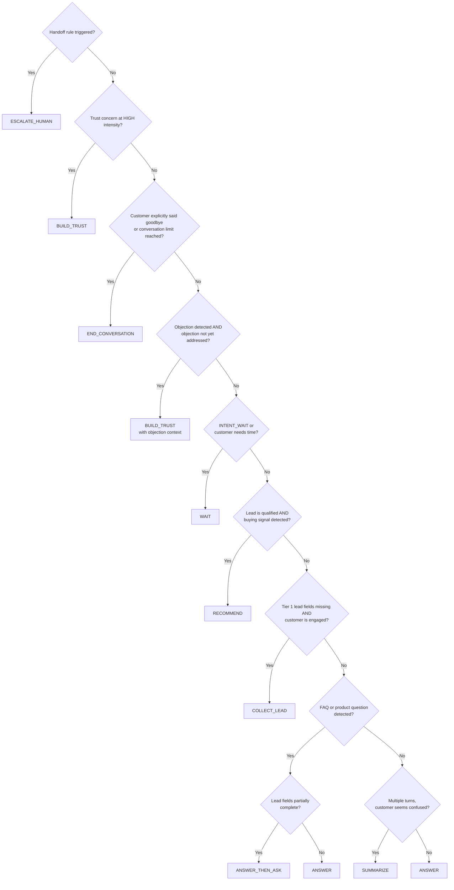

# 05 — Decision Pipeline
### AI Execution Engine — Deterministic Action Selection
**Version:** 1.0
**Effective Date:** 2026-06-26
**Status:** Active
**Authority:** Chief AI System Architect

---

## Purpose

Define the complete, deterministic logic by which the AI Execution Engine selects the next action. Given the same ExecutionContext, the Decision Pipeline must always produce the same action. There is no ambiguity, no randomness, and no model-dependent choice at this layer.

---

## Scope

This document covers:
- The complete action set available to the engine
- The decision rules and their evaluation order
- The decision tree structure
- Priority conflicts and resolution
- Action parameters (what each action carries)

This document does not cover:
- How the response is composed after a decision (see `06_RESPONSE_COMPOSER.md`)
- How capabilities inform decision inputs (see `03_CAPABILITY_LOADER.md`)

---

## The Action Set

The Decision Pipeline produces exactly one action per execution turn:

| Action | Meaning |
|---|---|
| `ANSWER` | Respond to a question or statement directly |
| `ANSWER_THEN_ASK` | Answer the question, then ask a lead-capture or clarifying question |
| `BUILD_TRUST` | Address trust concern before any other action |
| `RECOMMEND` | Surface a product recommendation |
| `COLLECT_LEAD` | Ask for a missing required lead field |
| `ESCALATE_HUMAN` | Transfer conversation to human advisor |
| `WAIT` | Acknowledge receipt without adding new information; wait for customer |
| `SUMMARIZE` | Summarize the conversation and lead profile; confirm understanding |
| `END_CONVERSATION` | Gracefully close the conversation |

---

## Decision Evaluation Order

Rules are evaluated in strict priority order. The first rule that matches produces the action. No further rules are evaluated after a match.



---

## Rule Definitions

### Rule 1 — Escalate Human (Priority 1, Absolute)

**Condition:** ANY of the following is true:
- `IntentResult.primary_intent` is `INTENT_REQUEST_HUMAN` or `INTENT_CALL_BACK`
- Any escalation rule from `Human/Escalation_Rules.md` is met:
  - Lead status is `qualified` AND buying signal detected
  - Customer has declared a complex health condition requiring manual underwriting
  - Customer complaint or high-severity frustration detected (`EMOTION_FRUSTRATED` at HIGH)
  - Maximum AI-only turns reached without resolution
  - Trust score below minimum threshold
- `HandoffEngine` (CAP-007) set `handoff_ready=true`

**Action:** `ESCALATE_HUMAN`

**Parameters:**
- `handoff_context` — advisor context package (from HandoffEngine)
- `handoff_trigger` — which rule triggered the escalation
- `handoff_message` — what to say to the customer

---

### Rule 2 — Build Trust (Priority 2)

**Condition:** ANY of the following is true:
- `EmotionResult.primary_emotion` is `SKEPTICAL` at intensity HIGH
- `EmotionResult.primary_emotion` is `ANXIOUS` at intensity HIGH
- `IntentResult` is `INTENT_SCAM_CONCERN` or `INTENT_VERIFY_LEGITIMACY`
- `TrustEngine` (CAP-002) is active AND `trust_action` is `REASSURE` or `VERIFY`

**Action:** `BUILD_TRUST`

**Parameters:**
- `trust_action` — from TrustEngine output
- `trust_response_type` — ACKNOWLEDGE | VERIFY_IDENTITY | SHOW_CREDENTIALS | SOCIAL_PROOF

---

### Rule 3 — End Conversation (Priority 3)

**Condition:** ANY of the following is true:
- `IntentResult` is `INTENT_GOODBYE` AND no outstanding lead fields are missing
- Session turn count exceeds maximum defined limit
- Customer confirmed they do not want further contact (`INTENT_GOODBYE` + explicit decline)

**Action:** `END_CONVERSATION`

**Parameters:**
- `closing_type` — NATURAL | TIMEOUT | EXPLICIT_DECLINE
- `closing_message` — warm, professional closing text

---

### Rule 4 — Build Trust for Objection (Priority 4)

**Condition:** ALL of the following are true:
- `ObjectionEngine` (CAP-006) is active
- `objection_type` is detected
- This objection has not been addressed in a prior turn

**Action:** `BUILD_TRUST` (with objection context modifier)

**Parameters:**
- `objection_type` — from ObjectionEngine
- `objection_response` — from objection library
- `empathy_required` — true

---

### Rule 5 — Wait (Priority 5)

**Condition:** ANY of the following is true:
- `IntentResult` is `INTENT_GOODBYE` but customer is engaged (`lead_status=engaged`)
- Customer expressed need for time ("ขอคิดดูก่อน", "จะปรึกษาก่อน")
- Previous turn's action was `COLLECT_LEAD` and customer did not provide the requested field

**Action:** `WAIT`

**Parameters:**
- `wait_reason` — CUSTOMER_NEEDS_TIME | AWAITING_RESPONSE | DECLINED_FIELD
- `re_engagement_question?` — gentle follow-up to try after waiting

---

### Rule 6 — Recommend (Priority 6)

**Condition:** ALL of the following are true:
- `RecommendationEngine` (CAP-005) is active
- `lead_status` is `qualified` (per `Lead_Status.md`)
- `GoalResult.primary_goal` is `PURCHASE` or `COMPARE`
- `recommendation_confidence` from CAP-005 is ≥ 0.7

**Action:** `RECOMMEND`

**Parameters:**
- `recommended_products[]` — from RecommendationEngine
- `primary_recommendation` — single best-fit product
- `recommendation_rationale` — why this product fits the customer

---

### Rule 7 — Collect Lead (Priority 7)

**Condition:** ALL of the following are true:
- `LeadEngine` (CAP-003) is active
- At least one Tier 1 field is missing from `customer_profile`
- `ConversationContext.current_mode` is not HANDOFF
- Customer has not explicitly declined to provide information in this session

**Action:** `COLLECT_LEAD`

**Parameters:**
- `target_field` — the Tier 1 field to request next (from `Adaptive_Lead_Capture.md` tier order)
- `capture_question` — the natural-language question to ask

---

### Rule 8 — Answer Then Ask (Priority 8a)

**Condition:** ALL of the following are true:
- `IntentResult` is `INTENT_FAQ` | `INTENT_PRODUCT_INFO` | `INTENT_CLAIM_INFO` | `INTENT_TAX_INFO`
- Answer can be resolved from available knowledge (`answer_confidence` ≥ 0.6)
- Customer profile has at least one missing Tier 2 field
- This is not the customer's first turn (do not interrogate on first message)

**Action:** `ANSWER_THEN_ASK`

**Parameters:**
- `answer_content` — from FAQEngine
- `follow_up_field` — which Tier 2 field to ask after answering
- `follow_up_question` — naturally bridged question

---

### Rule 8b — Answer (Priority 8b)

**Condition:** Intent is informational AND Rule 8a does not apply (no missing Tier 2 fields, or first turn, or no knowledge available for partial-answer-and-ask)

**Action:** `ANSWER`

**Parameters:**
- `answer_content` — from FAQEngine or ConversationContext

---

### Rule 9 — Summarize (Priority 9)

**Condition:** ALL of the following are true:
- Session turn count ≥ 5
- `INTENT_UNKNOWN` occurs two or more times in prior 3 turns
- OR customer message signals confusion ("ไม่เข้าใจ", "หมายความว่าอะไร")
- No other higher-priority rule matches

**Action:** `SUMMARIZE`

**Parameters:**
- `summary_content` — what has been discussed and what is known
- `clarifying_question` — a single question to re-establish direction

---

### Default — Answer

**Condition:** No rule above matches.

**Action:** `ANSWER`

**Parameters:**
- `answer_content` — best-available response from context

---

## Decision Output Format

```
Decision {
  action: ActionEnum
  action_rationale: {
    rule_matched: string          // e.g., "Rule 7 — Collect Lead"
    conditions_met: string[]      // which conditions triggered
  }
  parameters: {
    // action-specific parameters as defined above
  }
  confidence: float               // 0.0–1.0 confidence in this decision
  alternative_action?: ActionEnum // second-best action, for logging
}
```

---

## Decision Audit Requirement

Every Decision must be fully reconstructable from its `action_rationale`. An auditor must be able to read the ExecutionContext and the `action_rationale` and verify that the correct rule was applied. No black-box decisions are permitted at this layer.

---

## Dependencies

- `02_EXECUTION_PIPELINE.md` — Step 8 invokes the Decision Pipeline
- `03_CAPABILITY_LOADER.md` — Capability outputs feed decision inputs
- `AIOS/Domains/Insurance/Human/Escalation_Rules.md` — Rule 1 conditions
- `AIOS/Domains/Insurance/Lead/Adaptive_Lead_Capture.md` — Rule 7 field tier
- `AIOS/Domains/Insurance/Lead/Lead_Status.md` — Rule 6 qualification check

---

## Future Extensions

- `BROADCAST` action: proactively push information (e.g., renewal reminder)
- `MULTI_RECOMMEND` action: show comparison of 2–3 products with explicit pros/cons
- `EDUCATE` action: structured information delivery for complex topics (multi-turn)

---

## Version History

| Version | Date | Author | Change Description |
|---|---|---|---|
| 1.0 | 2026-06-26 | Chief AI System Architect | Initial creation — 9 actions, 9 rules with full conditions and parameters |
