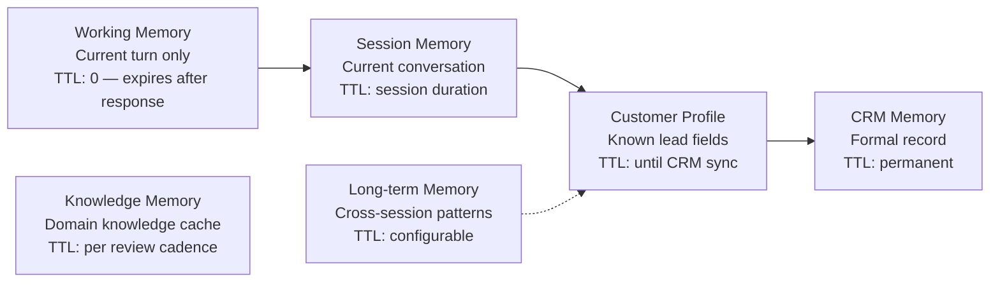

# 07 — Memory Engine
### AI Execution Engine — Memory Architecture
**Version:** 1.0
**Effective Date:** 2026-06-26
**Status:** Active
**Authority:** Chief AI System Architect

---

## Purpose

Define how AIOS manages memory across different time horizons and purposes. The Memory Engine is the persistence layer of the AEE. It defines what should be remembered, what should expire, and what belongs in which memory layer. It does not define how any specific application implements persistence.

---

## Scope

This document covers:
- The five memory layers and their definitions
- What each layer stores, its TTL, and its ownership
- Read and write rules per layer
- Memory priority and conflict resolution
- What happens when memory is unavailable

This document does not cover:
- Technical storage implementations (Vercel KV, database, etc.) — Application concern
- Session persistence mechanics — Application concern
- CRM write protocol — see `Applications/Line_Chatbot_AI/Integrations/Lead_Synchronization.md`

---

## Architecture Principle

Memory is separated into layers by time horizon and purpose. Mixing them creates fragility — a session store going down should not destroy the customer's lead profile. Each layer has a different owner, different TTL, and different failure behavior.

---

## Memory Layer 1 — Working Memory

### Definition
Transient state that exists only during the current execution turn. It holds the accumulated ExecutionContext as the pipeline processes it. Working memory is constructed at Step 1 (Receive Input) and discarded after Step 9 (Response Composer) completes.

### What Is Stored
- Current ExecutionContext (all pipeline step outputs for this turn)
- In-progress capability outputs not yet committed to session memory
- Temporary computation results

### TTL
Zero — expires at end of turn. Nothing in working memory persists beyond the current pipeline execution.

### Read Rules
- Read by all pipeline steps during execution

### Write Rules
- Written by all pipeline steps in sequence
- No external write access

### Failure Handling
- Working memory failure is a fatal error for the current turn — return safe fallback response
- The failure is isolated to one turn and does not affect session or profile

---

## Memory Layer 2 — Session Memory

### Definition
Conversation-scoped memory that persists for the duration of one customer session. It holds the conversation history, current mode, and any state that must survive across multiple turns in the same conversation.

### What Is Stored

| Field | Description |
|---|---|
| `session_id` | Channel-agnostic session identifier |
| `customer_id` | Customer identifier |
| `turn_history[]` | Array of prior turns: intent, decision, response summary, emotion |
| `current_mode` | GREETING \| FAQ \| LEAD_CAPTURE \| PRODUCT \| CLOSING \| HANDOFF |
| `session_turn_count` | Total turns in this session |
| `trust_state` | Current trust score and active trust signals |
| `objections_addressed[]` | Which objection types have already been handled |
| `fields_requested_this_session[]` | Which lead fields have been requested (to avoid repetition) |
| `handoff_triggered` | Boolean — whether handoff has fired this session |

### TTL
Session duration + configurable idle timeout (recommended: 30 minutes of inactivity). Session memory is separate from profile — expiry does not destroy the customer's lead profile.

### Read Rules
- Read at Step 2 (Conversation Context)
- Read by any capability that needs conversation history

### Write Rules
- Written at Step 10 (Memory Update) after each turn
- Only the AEE writes to session memory; Application Adapters read it via the Session Interface

### Failure Handling
- If session memory is unavailable at read: initialize empty session; log warning; treat as new conversation
- If session memory fails at write: log error; do not retry synchronously; the turn is not lost (WorkingMemory has the data)
- Application Adapter may queue session writes for replay

---

## Memory Layer 3 — Customer Profile

### Definition
Accumulated lead data for an individual customer, built progressively across turns and sessions. The customer profile is the in-memory representation of the lead record before it is committed to CRM.

### What Is Stored
All fields defined in `AIOS/Domains/Insurance/Lead/Lead_Data_Model.md`, including:
- Identity fields (line_user_id, display_name, real_name, channel)
- Demographic fields (age, gender, occupation, etc.)
- Financial fields (monthly_income, budget_annual, etc.)
- Health fields (health_status, cancer_status)
- Interest fields (interest_category, product_interest)
- Scoring fields (lead_score, lead_status, follow_up_status)
- Conversation fields (conversation_summary, last_question)
- Tracking fields (source, first_contact_date, last_contact_date)

### TTL
Persists until explicitly synced to CRM (Layer 5) or until the session expires with no CRM sync. If a session expires without CRM sync, the profile update for that session is lost — this is a known risk documented in `03_CURRENT_STATUS.md`.

### Read Rules
- Read at Step 2 (Conversation Context) to hydrate `customer_profile`
- Read by LeadEngine (CAP-003) to determine missing fields
- Read by RecommendationEngine (CAP-005) for product matching

### Write Rules
- Written at Step 10 (Memory Update) whenever a new lead field is captured
- Lead_status and lead_score are written when their computed values change
- Field values follow the ownership rules in `Lead_Data_Model.md` — application may write, never redefine

### Failure Handling
- If profile cannot be loaded: use empty profile; flag `profile_unavailable=true`; LeadEngine treats customer as new
- If profile write fails: log error; Application Adapter queues for CRM sync retry

---

## Memory Layer 4 — Long-term Memory

### Definition
Cross-session patterns and facts about a customer that inform future conversations. Long-term memory enables the engine to recognize returning customers and adapt to their history without requiring them to repeat context.

### What Is Stored

| Field | Description |
|---|---|
| `returning_customer` | Boolean — has this customer had a prior complete session? |
| `prior_interest_categories[]` | Insurance categories the customer has shown interest in across sessions |
| `prior_objections[]` | Objection types the customer has raised; avoid re-triggering |
| `prior_handoff_attempts` | Count of prior handoff triggers that did not result in sale |
| `re_engagement_note` | Brief summary of where the last conversation ended |
| `first_contact_date` | From lead model — when the customer first contacted |

### TTL
Configurable. Recommended: 365 days. After TTL, treat customer as new.

### Read Rules
- Read at Step 2 (Conversation Context) to populate `is_returning_customer` and `prior_interest_categories`

### Write Rules
- Written at session close or CRM sync
- Never written mid-session

### Failure Handling
- If long-term memory is unavailable: treat as new customer; log warning; continue

---

## Memory Layer 5 — CRM Memory

### Definition
The formal, permanent record of the customer lead. CRM Memory is the only layer that is considered authoritative and permanent. It is the source of record for advisors.

### What Is Stored
The full lead record as defined by `Lead_Data_Model.md`, as implemented in the Application's CRM (e.g., Google Sheets for LINE Chatbot AI).

### TTL
Permanent. CRM records are never deleted by the engine — only marked with updated statuses.

### Read Rules
- Read at Step 2 for returning customers — hydrates Customer Profile from last CRM state
- CRM is the initial profile state for any customer who has interacted before

### Write Rules
- Written by the Application Adapter when triggered by Step 10 Memory Update
- CRM writes are asynchronous and are governed by `Integrations/Lead_Synchronization.md`
- The AEE triggers the write; the Application Adapter executes it

### Failure Handling
- CRM write failure is non-fatal — log, queue for retry, continue
- CRM read failure: use empty profile; proceed as new customer

---

## Memory Layer 6 — Knowledge Memory

### Definition
Cached domain knowledge for efficiency. Knowledge Memory stores recently resolved knowledge bundles to avoid redundant resolution in high-frequency sessions.

### What Is Cached
- Resolved KnowledgeBundles (keyed by intent + domain + capability set)
- FAQ content (cached by the Application Adapter — e.g., 60-second TTL for Google Sheet CSV)

### TTL
Short — per the source's review cadence. Knowledge cache is invalidated on source update.

### Read Rules
- Read by the Knowledge Resolver (Step 7) before going to primary knowledge sources

### Write Rules
- Written by the Knowledge Resolver after successful resolution

### Failure Handling
- Cache miss: resolve from primary source; this is not an error

---

## Memory Priority at Read Time

When a customer's data exists in multiple layers (e.g., CRM shows an old lead_status, session memory shows a newer one):

| Conflict | Winner |
|---|---|
| Session Memory vs CRM Memory | Session Memory (more recent) |
| Customer Profile (in-session) vs CRM Memory | Customer Profile (in-session) |
| CRM Memory vs Long-term Memory | CRM Memory (authoritative) |
| Working Memory vs Session Memory | Working Memory (current turn) |

---

## Memory Update Decision Rules (Step 10)

At Step 10, the AEE decides what to write to each layer:

| Condition | Write To |
|---|---|
| New lead field captured this turn | Layer 3 (Customer Profile) |
| Lead score changed | Layer 3 (Customer Profile) |
| Lead status changed | Layer 3 + Layer 5 (trigger CRM sync) |
| Handoff triggered | Layer 3 + Layer 5 (trigger CRM sync immediately) |
| Conversation mode changed | Layer 2 (Session Memory) |
| Objection addressed | Layer 2 (Session Memory → `objections_addressed[]`) |
| Turn completed | Layer 2 (Session Memory → `turn_history[]`) |
| Session ended cleanly | Layer 4 (Long-term Memory) + Layer 5 (CRM sync) |

---

## Dependencies

- `02_EXECUTION_PIPELINE.md` — Steps 2 and 10 invoke memory operations
- `AIOS/Domains/Insurance/Lead/Lead_Data_Model.md` — Customer Profile field schema
- `09_EXECUTION_CONTRACT.md` — MemoryInterface definition

---

## Future Extensions

- Knowledge graph layer: structured relationship memory across customers, products, and conversations
- Preference memory: remembered preferences (communication style, topic sensitivity)
- Advisor memory: what the advisor communicated post-handoff, synced back to customer profile

---

## Version History

| Version | Date | Author | Change Description |
|---|---|---|---|
| 1.0 | 2026-06-26 | Chief AI System Architect | Initial creation — 6 memory layers with full TTL, read/write, and failure specifications |
