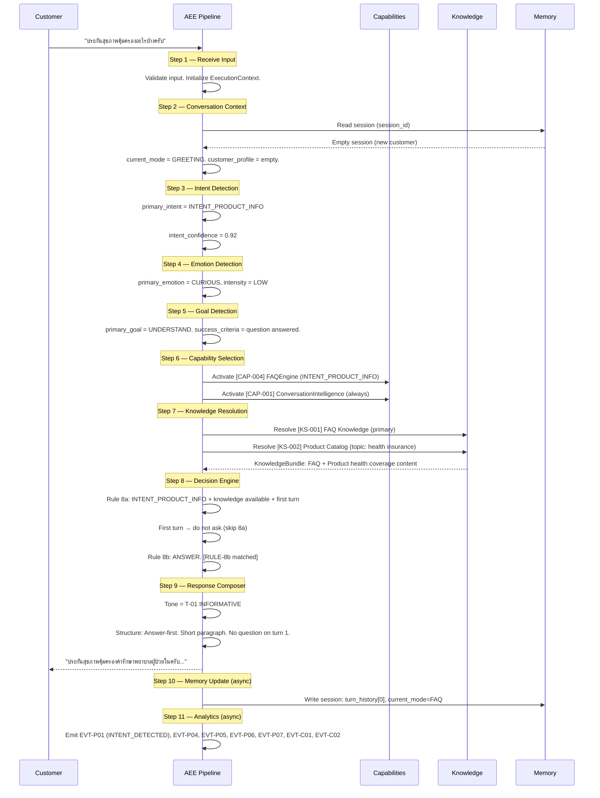
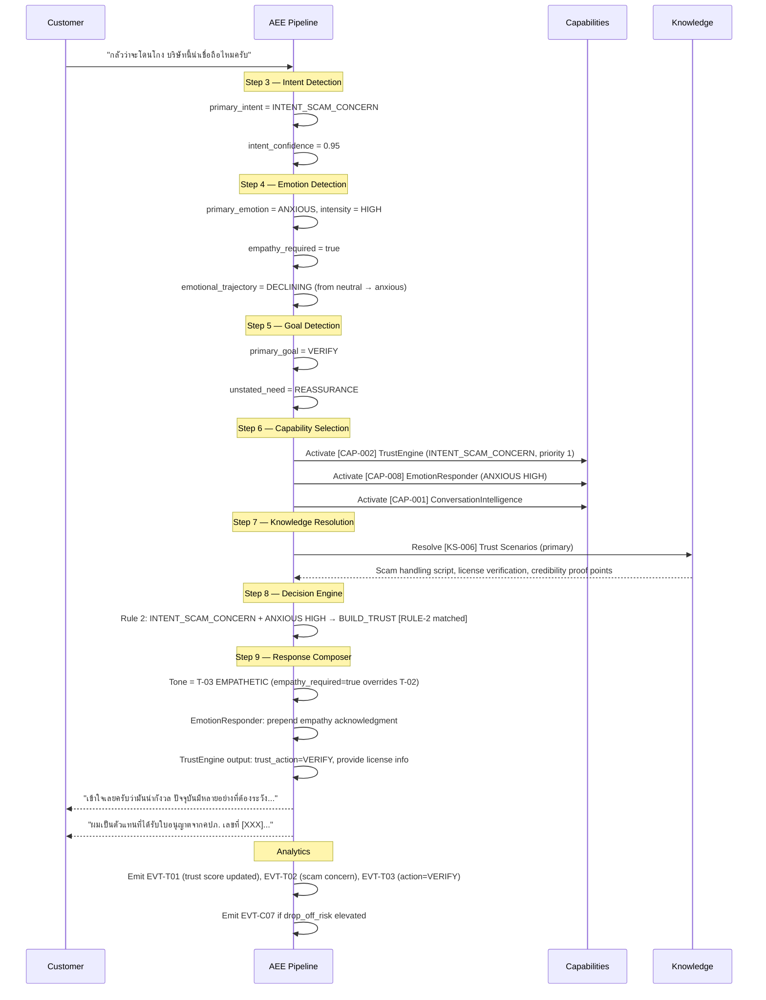
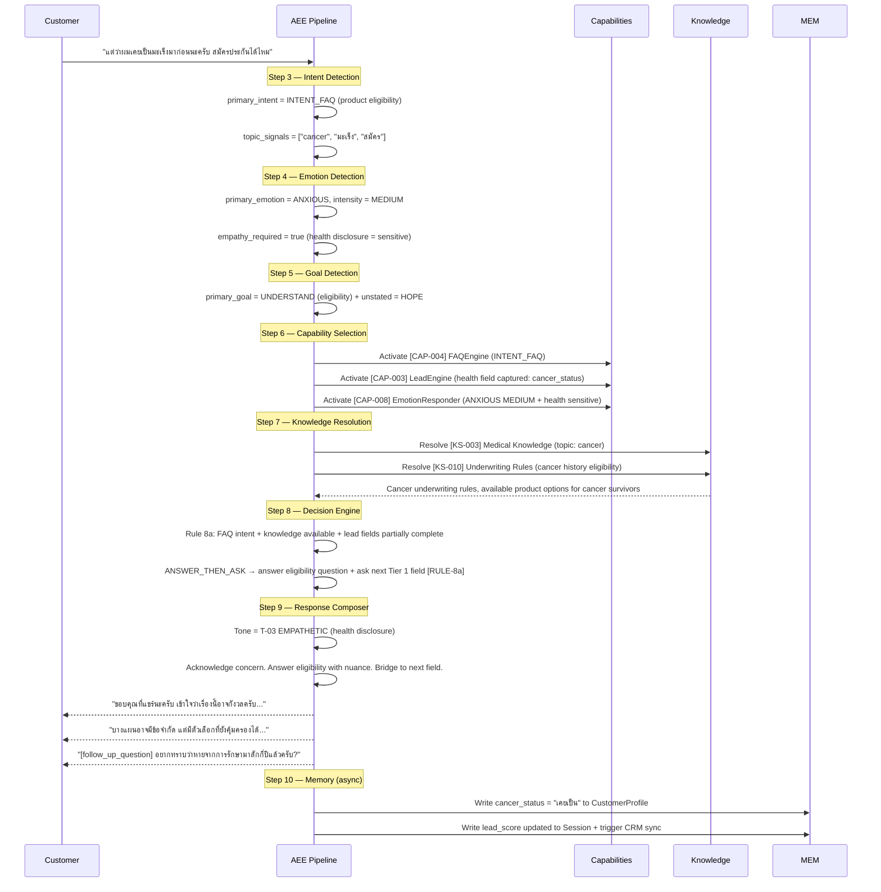
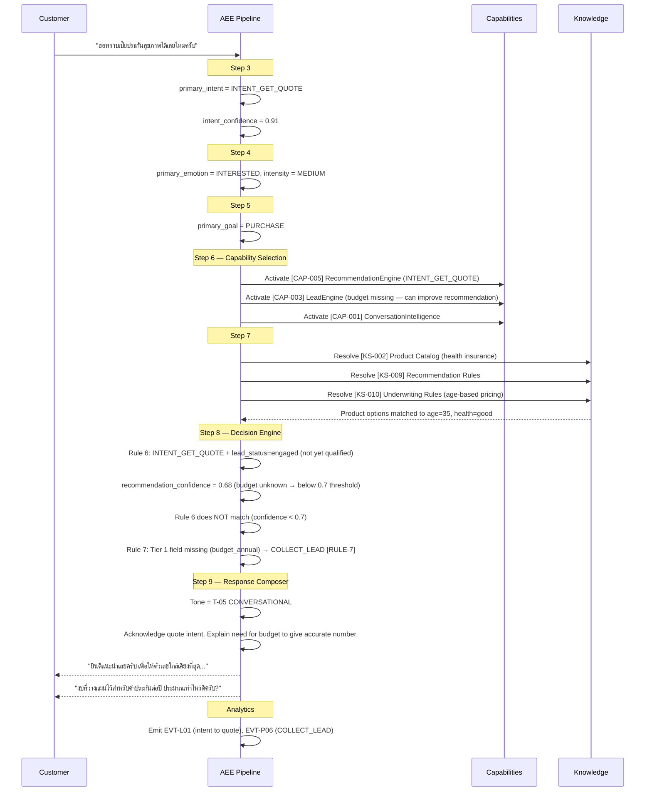
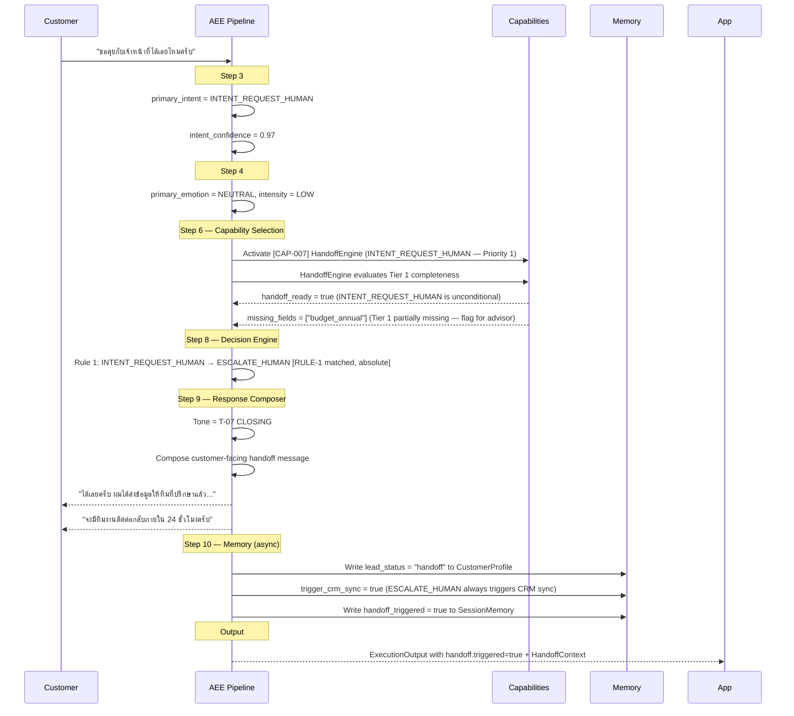
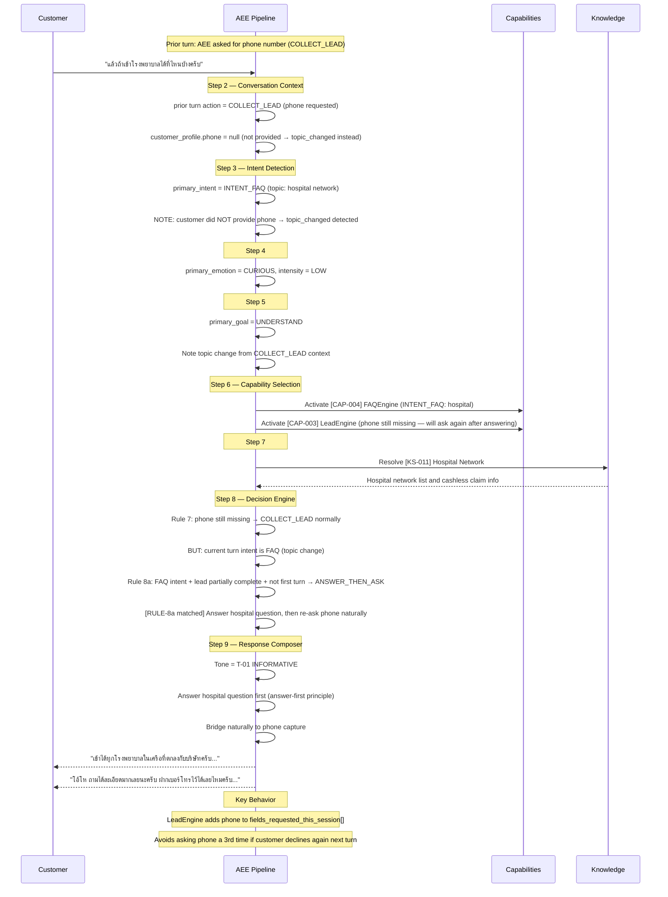

# 10 — Execution Sequence
### AI Execution Engine — Key Scenario Walkthroughs
**Version:** 1.0
**Effective Date:** 2026-06-26
**Status:** Active
**Authority:** Chief AI System Architect

---

## Purpose

Demonstrate how the AI Execution Engine processes six key customer scenarios. Each sequence shows which pipeline steps fire, which capabilities activate, which knowledge sources resolve, and what decision and response result. These sequences validate the execution architecture against real-world use cases.

---

## Scope

This document covers six annotated sequence diagrams:
1. Customer asks about health insurance
2. Customer worries about scam
3. Customer discloses cancer history
4. Customer requests a quotation
5. Customer requests a human advisor
6. Customer changes topic during lead capture

These diagrams are technology-independent. They show AEE thinking — not LINE events, webhook payloads, or AI model calls.

---

## Notation

Each sequence shows the pipeline steps as vertical lanes and annotates what flows through them. `[CAP-NNN]` = capability activated. `[KS-NNN]` = knowledge resolved. `[RULE-N]` = decision rule matched.

---

## Scenario 1 — Customer Asks About Health Insurance

**Customer message:** "ประกันสุขภาพคุ้มครองอะไรบ้างครับ"
**Session state:** New customer, first turn, no prior context.

**Key takeaway:** First turn FAQ scenario — no lead capture, pure informative answer. Capabilities: 2. Knowledge sources: 2. Decision: ANSWER.

---

## Scenario 2 — Customer Worries About Scam

**Customer message:** "กลัวว่าจะโดนโกง บริษัทนี้น่าเชื่อถือไหมครับ"
**Session state:** Turn 3, currently in FAQ mode, emotion history = neutral.

**Key takeaway:** Trust scenario overrides normal flow. Empathy comes before information. TrustEngine fires at Priority 1. Decision: BUILD_TRUST.

---

## Scenario 3 — Customer Discloses Cancer History

**Customer message:** "แต่ว่าผมเคยเป็นมะเร็งมาก่อนนะครับ สมัครประกันได้ไหม"
**Session state:** Turn 5, lead capture in progress, Tier 1 fields partially collected.

**Key takeaway:** Health disclosure triggers Medical Knowledge + Underwriting. Empathy mandatory on health sensitive topics. LeadEngine captures `cancer_status` as a side effect of the FAQ answer. Decision: ANSWER_THEN_ASK.

---

## Scenario 4 — Customer Requests Quotation

**Customer message:** "ขอทราบเบี้ยประกันสุขภาพได้เลยไหมครับ"
**Session state:** Turn 7, lead_status = engaged, Tier 1 mostly complete (missing budget only), lead_score = 58.

**Key takeaway:** Quote intent triggers RecommendationEngine but confidence is too low without budget. Decision falls through to COLLECT_LEAD first. Once budget is captured next turn, RecommendationEngine will have enough data to qualify the lead.

---

## Scenario 5 — Customer Requests a Human Advisor

**Customer message:** "ขอคุยกับเจ้าหน้าที่ได้เลยไหมครับ"
**Session state:** Turn 4, lead_status = engaged, lead_score = 45, Tier 1 partial.

**Key takeaway:** `INTENT_REQUEST_HUMAN` triggers Rule 1 immediately — no other rule is evaluated. HandoffEngine is Priority 1. Lead status transitions to `handoff`. CRM sync is triggered. Missing fields are flagged in HandoffContext for advisor.

---

## Scenario 6 — Customer Changes Topic During Lead Capture

**Customer message:** "แล้วถ้าเข้าโรงพยาบาลได้ที่ไหนบ้างครับ" *(during phone number capture)*
**Session state:** Turn 3, current_mode = LEAD_CAPTURE, last action was COLLECT_LEAD asking for phone number.

**Key takeaway:** Topic change during lead capture is handled gracefully. AEE answers the new question first (answer-first principle), then re-approaches the missing field naturally. If customer declines again, `fields_requested_this_session[]` prevents the engine from repeating the same request. Decision: ANSWER_THEN_ASK.

---

## Cross-Scenario Patterns

| Scenario | Rule | Decision | Trust Action | Lead Action |
|---|---|---|---|---|
| Health insurance FAQ | Rule 8b | ANSWER | — | — |
| Scam concern | Rule 2 | BUILD_TRUST | VERIFY + REASSURE | — |
| Cancer disclosure | Rule 8a | ANSWER_THEN_ASK | Empathy only | Capture cancer_status |
| Quote request (incomplete) | Rule 7 | COLLECT_LEAD | — | Capture budget |
| Request human | Rule 1 | ESCALATE_HUMAN | — | Handoff |
| Topic change mid-capture | Rule 8a | ANSWER_THEN_ASK | — | Re-ask field |

---

## Dependencies

- `02_EXECUTION_PIPELINE.md` — Steps referenced in each sequence
- `03_CAPABILITY_LOADER.md` — CAP-NNN capabilities
- `04_KNOWLEDGE_RESOLVER.md` — KS-NNN knowledge sources
- `05_DECISION_PIPELINE.md` — Rules referenced
- `06_RESPONSE_COMPOSER.md` — Tones applied
- `07_MEMORY_ENGINE.md` — Memory operations
- `08_ANALYTICS_ENGINE.md` — Events emitted

---

## Version History

| Version | Date | Author | Change Description |
|---|---|---|---|
| 1.0 | 2026-06-26 | Chief AI System Architect | Initial creation — 6 scenarios with full sequence diagrams and cross-scenario pattern table |
