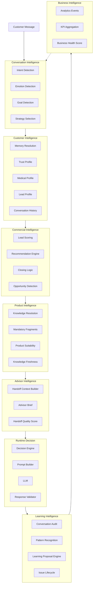

# 00 — AIOS Intelligence Architecture Overview

**Document ID**: AIOS-INT-00  
**Version**: 1.0  
**Date**: 2026-06-29  
**Status**: Active  
**Authority**: Chief AI Architect  
**Approved From**: Phase 11.0A Architecture & Capability Audit

---

## 1. Why AIOS Needs an Intelligence Architecture

AIOS began as a single LINE chatbot. It has evolved into a governed AI platform with:
- 20 Capability Packages (ACP-01 to ACP-20)
- A 10-step deterministic execution pipeline (Gen1 runtime)
- A full Context Engine specification (15 documents)
- A complete Learning governance system (10 documents)
- 36+ domain knowledge documents

This growth has created a maturity gap: **AIOS is architecturally well-specified but does not yet define who is responsible for which intelligence**.

Without named intelligence owners, the following problems emerge:

| Problem | Symptom |
|---|---|
| Duplicate capabilities | V1 trustEngine + Gen1 trust logic; two intent classifiers; two lead scorers |
| Unknown ownership | Bug in trust detection — which team fixes it? |
| No SSI (Single Source of Intelligence) | Changes to trust rules updated in one place; silently diverge elsewhere |
| No capability evolution path | Emotion detection specified but no owner to build it |
| No business feedback loop | Analytics defined but no intelligence processes the events |
| Governance vacuum | Learning System has governance documents but no processor intelligence |

The Intelligence Architecture Layer addresses this by assigning **exactly one owner** to every capability, defining how intelligences interact, and providing a governed roadmap for capability evolution.

---

## 2. From Chatbot to Business Advisor Platform

AIOS is evolving through three phases:

```
Phase 1 — Chatbot
  Single application, V1 runtime, inline prompt, ad hoc rules
  Status: Complete (lib/, runtime-v1/)

Phase 2 — Governed Runtime
  Gen1 10-step pipeline, ACP packages, ACE context engine,
  deterministic decisions, KV persistence, learning observability
  Status: Active (runtime-gen1/, gen1-stub-0.9.0)

Phase 3 — Business Advisor Platform
  Named intelligence owners, cross-session customer memory,
  commercial opportunity detection, learning feedback loop,
  business intelligence, advisor enrichment
  Status: This document defines Phase 3
```

The Intelligence Architecture is the governance framework that enables Phase 3 without redesigning Phase 2.

**Key principle:** Intelligence Architecture owns capability boundaries. It does not replace the runtime.

---

## 3. Where Intelligence Architecture Sits

Intelligence Architecture is a new conceptual layer that governs existing layers. It does not replace any layer.

```
╔══════════════════════════════════════════════════════════════════╗
║  INTELLIGENCE ARCHITECTURE LAYER  (AIOS/Intelligence/)           ║
║  Owns capability boundaries, SSI, interaction model, roadmap     ║
╠══════════════════════════════════════════════════════════════════╣
║  LEARNING LAYER       (AIOS/Learning/)                           ║
║  Conversation Audit · Pattern Library · Change Proposal          ║
╠══════════════════════════════════════════════════════════════════╣
║  CAPABILITY LAYER     (AIOS/CapabilityPackages/)                 ║
║  ACP-01 through ACP-20 · CAP-001 through CAP-008                ║
╠══════════════════════════════════════════════════════════════════╣
║  CONTEXT ENGINE       (AIOS/ContextEngine/)                      ║
║  ACE · Memory · Knowledge · Decision · Validation               ║
╠══════════════════════════════════════════════════════════════════╣
║  EXECUTION ENGINE     (AIOS/Execution/)                          ║
║  AEE 11-step pipeline · Intent · Emotion · Goal · Response      ║
╠══════════════════════════════════════════════════════════════════╣
║  DOMAIN KNOWLEDGE     (AIOS/Domains/)                            ║
║  Products · Underwriting · Trust · Sales · Recommendation       ║
╠══════════════════════════════════════════════════════════════════╣
║  FOUNDATION           (AIOS/01-14 docs, Architecture-Office/)    ║
║  Vision · Principles · Constitution · Operating Model           ║
╚══════════════════════════════════════════════════════════════════╝

Intelligence Architecture governs ALL layers above Foundation.
Foundation governs Intelligence Architecture.
```

---

## 4. The Intelligence Architecture Map



---

## 5. What Intelligence Architecture Owns

| Owned | Not Owned |
|---|---|
| Capability boundary definitions | Runtime TypeScript code |
| Single Source of Intelligence assignments | ACP specification content |
| Cross-intelligence interaction model | Domain knowledge (products, underwriting) |
| Capability gap identification | Prompt templates |
| Intelligence roadmap | Insurance-specific selling strategy |
| Governance gates for new capabilities | LLM model selection |
| SSI violation detection | Application-layer configuration |

---

## 6. Relationship to Existing AIOS Documents

| Existing Document | Relationship |
|---|---|
| `AIOS/04_AI_Constitution.md` | Constitutional authority over Intelligence Architecture |
| `AIOS/ContextEngine/` (15 docs) | ACE is consumed by Customer Intelligence and Product Intelligence |
| `AIOS/Execution/` (10 docs) | AEE pipeline is the runtime implementation of intelligence decisions |
| `AIOS/CapabilityPackages/` (20 × 11 docs) | ACP documents are owned by specific intelligence domains |
| `AIOS/Learning/` (10 docs) | Governance framework owned and processed by Learning Intelligence |
| `AIOS/Domains/Insurance/` | Domain knowledge owned by Product Intelligence (content); Customer Intelligence (trust, medical); Commercial Intelligence (sales, lead) |
| `AIOS/AIRR/Capability_Registry_Reconciliation.md` | CAP-to-ACP mapping governs how Capability Intelligence selects packages |
| `AIOS/AIRR/Knowledge_Path_Registry.md` | Canonical knowledge paths governed by Product Intelligence |
| `Architecture-Office/AI_OPERATING_MODEL.md` | Role authority; Intelligence Architecture does not change role assignments |

---

## 7. Design Principles

These principles govern all Intelligence Architecture decisions. They complement (and never override) the AI Constitution.

**P1 — One Capability, One Owner**  
Every capability has exactly one intelligence domain as its owner. Consumers are unlimited, but owners are singular. See `01_SINGLE_SOURCE_OF_INTELLIGENCE.md`.

**P2 — Extension Before Creation**  
Before creating a new capability, verify it does not already exist — even partially — in another intelligence domain. Extend first; create only when extension is impossible.

**P3 — Reference, Do Not Duplicate**  
Intelligence Architecture documents reference existing AIOS documents. They do not duplicate their content. If content must move, an ADR is required.

**P4 — Domain Independence**  
Intelligence domains are defined in terms that apply to any advisory domain — Insurance, Tax, Investment, Hotel, Healthcare. Domain-specific knowledge belongs in `AIOS/Domains/`, never in `AIOS/Intelligence/`.

**P5 — Human Approval for Ownership Changes**  
Reassigning ownership of a capability from one intelligence to another requires Human Product Owner approval and an ADR.

**P6 — Intelligence Does Not Replace Runtime**  
Intelligence Architecture defines what capabilities do and who owns them. The Gen1 runtime implements those capabilities. Intelligence documents govern; runtime implements.

---

## 8. Authority

This document and the entire `AIOS/Intelligence/` folder operate under:

- `AIOS/04_AI_Constitution.md` — Constitutional authority
- `AIOS/01_AI_Principles.md` — Behavioral principles
- `AIOS/Architecture-Office/AI_OPERATING_MODEL.md` — Role authority
- Phase 11.0A Architecture & Capability Audit — Founding evidence base

Any conflict between this document and the AI Constitution must be resolved in favor of the Constitution.
