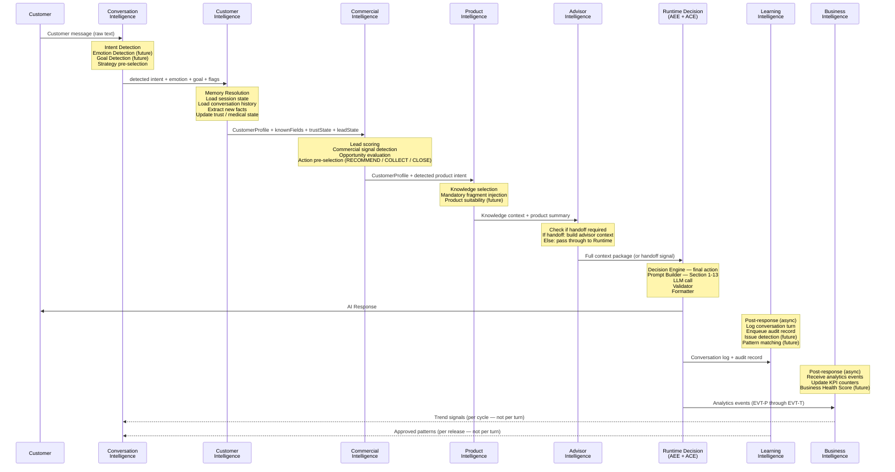

# 06 — Intelligence Interaction Model

**Document ID**: AIOS-INT-06  
**Version**: 1.0  
**Date**: 2026-06-29  
**Status**: Active  
**Authority**: Chief AI Architect

---

## Purpose

This document defines how the 7 AIOS intelligence domains interact within a single customer turn — what data each produces, what each consumes, and what the interaction sequence looks like.

The interaction model is **not** a sequence of microservice calls. In the current Gen1 runtime, all intelligence is collocated in a single synchronous pipeline. This document describes the *logical* intelligence interactions, which the runtime implements in `runtime-gen1/core/runtime.ts`.

---

## 1. Full Turn Interaction Flow

---

## 2. Data Exchanged at Each Boundary

### Boundary 1: Customer → Conversation Intelligence

| Data | Direction | Type |
|---|---|---|
| Raw customer message text | Customer → CI | string |
| Channel context (LINE, web, voice) | Channel → CI | enum |
| Timestamp | System → CI | ISO-8601 |

---

### Boundary 2: Conversation Intelligence → Customer Intelligence

| Data | Direction | Type |
|---|---|---|
| Detected intent | CI → CuI | IntentDetectorResult |
| Intent confidence | CI → CuI | float (0-1) |
| Trust signal flag | CI → CuI | boolean |
| Medical signal flag | CI → CuI | boolean |
| Emergency flag | CI → CuI | boolean |
| Human request flag | CI → CuI | boolean |
| Product intent flag | CI → CuI | boolean |
| Recommendation intent flag | CI → CuI | boolean |
| Detected emotion (future) | CI → CuI | EmotionResult |
| Inferred goal (future) | CI → CuI | GoalResult |

**Runtime**: `IntentDetectorResult` passed from `intentDetector.ts` → `capabilityLoader.ts` → `resolveMemory()`

---

### Boundary 3: Customer Intelligence → Commercial Intelligence

| Data | Direction | Type |
|---|---|---|
| CustomerProfile (all known fields) | CuI → CoI | CustomerProfile |
| knownFields list | CuI → CoI | string[] |
| missingFields list | CuI → CoI | MissingField[] |
| Trust state (active concern, turns since) | CuI → CoI | TrustMemory |
| Medical state (conditions, disclaimer required) | CuI → CoI | MedicalMemory |
| Lead memory (capture stage, value delivered) | CuI → CoI | LeadMemory |
| Trust-safe flag (lead capture allowed) | CuI → CoI | boolean |
| fieldsFromHistory (from KV history) | CuI → CoI | string[] |

**Runtime**: `RuntimeMemoryResolution` returned from `resolveMemory()` → consumed by `makeDecision()`

---

### Boundary 4: Commercial Intelligence → Product Intelligence

| Data | Direction | Type |
|---|---|---|
| CustomerProfile (age, budget, product interest) | CoI → PI | CustomerProfile |
| Detected product intent | CoI → PI | intent string |
| Selected capability (ACP identifier) | CoI → PI | string |
| Commercial action pre-selection | CoI → PI | ActionType |

**Runtime**: `KnowledgeSelectionInput` passed to `resolveKnowledge()` (contains capability + intent + memory)

---

### Boundary 5: Product Intelligence → Advisor Intelligence

| Data | Direction | Type |
|---|---|---|
| Loaded knowledge snippets (ranked) | PI → AI | KnowledgeSnippet[] |
| Mandatory fragments (medical, investment) | PI → AI | KnowledgeSnippet[] |
| Knowledge trace (sources, missing, warnings) | PI → AI | KnowledgeTrace |
| Product summary (for handoff brief) | PI → AI | string |

**Runtime**: `KnowledgeSelectionResult` returned from `resolveKnowledge()` → consumed by context builder

---

### Boundary 6: Advisor Intelligence → Runtime Decision

| Data | Direction | Type |
|---|---|---|
| Full ExecutionContext (all intelligence outputs assembled) | AI → RT | ExecutionContext |
| Handoff signal (if triggered) | AI → RT | boolean + HandoffContext |
| Advisor brief (if handoff) | AI → RT | string |
| Lead score at handoff | AI → RT | number |

**Runtime**: `ExecutionContext` built in `contextBuilder.ts` → passed to `makeDecision()` → `buildPrompt()` → LLM

---

### Boundary 7: Runtime Decision → Response (Customer)

| Data | Direction | Type |
|---|---|---|
| Response text (Thai, warm, structured) | RT → Customer | string |
| Quick replies (if applicable) | RT → Customer | QuickReply[] |
| Decision label (for trace) | RT → Trace | string |

---

### Boundary 8: Runtime → Learning Intelligence (async, post-response)

| Data | Direction | Type |
|---|---|---|
| ConversationLogEntry (26 fields) | RT → LI | ConversationLogEntry |
| AuditRecord (quality flags) | RT → LI | AuditRecord |
| [MEMORY_HISTORY] log | RT → LI | JSON object |
| [CONV_LOG] log | RT → LI | JSON object |

**Runtime**: `logConversationTurn()`, `enqueueAudit()` in observability — async, never blocks response

---

### Boundary 9: Runtime → Business Intelligence (async, post-response)

| Data | Direction | Type |
|---|---|---|
| Analytics events (EVT-P01 to P07) | RT → BI | AnalyticsEvent[] |
| Lead events (EVT-L01 to L06) | RT → BI | AnalyticsEvent[] |
| Trust events (EVT-T01 to T03) | RT → BI | AnalyticsEvent[] |

**Current gap**: Events are not yet emitted per-step. Exists as [CONV_LOG] post-turn. Full event emission is Gap G-11 (P0).

---

### Boundary 10: Learning Intelligence → Conversation Intelligence (cycle-level, not per-turn)

| Data | Direction | Type |
|---|---|---|
| Approved conversation patterns | LI → CI | Pattern[] |
| Updated strategy rules | LI → CI | StrategyRule[] |

**Cadence**: Per release cycle (Learning proposal → approval → deploy). Not real-time.

---

### Boundary 11: Business Intelligence → Conversation Intelligence (cycle-level)

| Data | Direction | Type |
|---|---|---|
| Trend signals (drop-off points, high-demand products) | BI → CI | TrendSignal[] |
| Quality KPI trends | BI → CI | MetricTrend[] |

**Cadence**: Per reporting period (daily/weekly). Not per-turn.

---

## 3. Which Intelligence May Override Another

| Intelligence | Can Override | Condition |
|---|---|---|
| Customer Intelligence (trust state) | Commercial Intelligence (lead capture) | Trust concern active → Commercial Intelligence MUST suspend lead capture regardless of lead stage |
| Customer Intelligence (medical state) | Product Intelligence (knowledge selection) | Medical signal → mandatory medical uncertainty fragment MUST be included |
| Conversation Intelligence (emergency flag) | All other intelligences | Emergency detected → ACT-07 EMERGENCY_ESCALATE; skip all other pipeline steps |
| AI Constitution (C1-C7) | ALL intelligences | Constitutional constraints override any intelligence decision |
| Learning Intelligence (approved change) | All intelligences | An approved and deployed change to ACP, knowledge, or memory rules overrides all prior behavior |

**Override rule**: Only Customer Intelligence (trust), Constitutional constraints, and Learning Intelligence (via approved changes) may override Commercial Intelligence's commercial actions. No intelligence overrides the AI Constitution.

---

## 4. Conflict Resolution

When two intelligences produce conflicting recommendations, the following hierarchy resolves the conflict:

| Priority | Rule | Example |
|---|---|---|
| 1 | AI Constitution (C1–C7) | Customer safety always wins |
| 2 | Trust concern (Customer Intelligence) | Active trust concern suspends ALL commercial actions |
| 3 | Medical compliance (Customer Intelligence + Product Intelligence) | Mandatory fragment inclusion is non-negotiable |
| 4 | Emergency detection (Conversation Intelligence) | Emergency escalation skips all other decisions |
| 5 | Human request (Conversation Intelligence) | If customer requests human, Advisor Intelligence triggers handoff regardless of lead stage |
| 6 | Decision Engine priority chain (CRITICAL > HIGH > STANDARD > LOW) | Resolves all remaining conflicts |
| 7 | ACP Decision_Rules (active ACP) | ACP-specific rules refine within priority |

---

## 5. Interaction Model vs. Gen1 Runtime

The table below maps logical intelligence boundaries to Gen1 runtime function calls:

| Logical Boundary | Gen1 Implementation |
|---|---|
| Customer → CI | `lineAdapter.ts` → `executeGen1()` (input normalization) |
| CI processing | `intentDetector.ts` (Step 1) |
| CI → CuI | `capabilityLoader.ts` (Step 2) → `resolveMemory()` (Step 3) |
| CuI → CoI | `resolveMemory()` result → `resolveKnowledge()` input (Step 4) |
| CoI → PI | `resolveKnowledge()` (Step 4) → `makeDecision()` (Step 5) |
| PI → AI | `buildContext()` assembles ExecutionContext (Step 6) |
| AI → RT | `buildPrompt()` (Step 8) → `callLlm()` (Step 9) |
| RT → LI (async) | `logConversationTurn()` + `enqueueAudit()` (post-response) |
| RT → BI (async) | Analytics event emission (Step 11 — currently [CONV_LOG] only) |

---

## 6. Future State: When Intelligence Becomes Distributed

The current Gen1 runtime collocates all intelligence in a single process. As AIOS scales, intelligence domains may be implemented as separate services. This interaction model remains valid — the boundaries become API calls rather than function calls.

**Migration principle**: The logical boundaries defined in this document are the stable contracts. Runtime topology (monolith vs. microservices vs. agent mesh) changes without changing this model.
