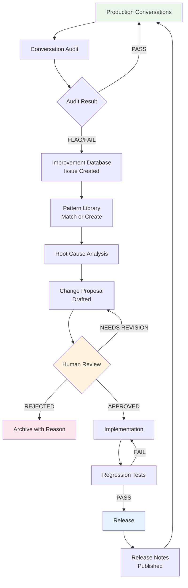
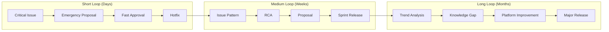
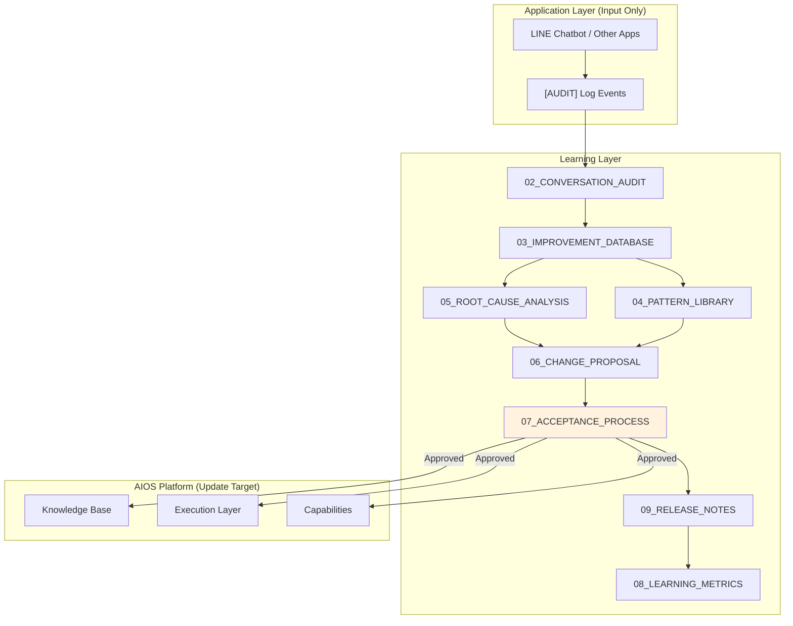

# 10 — Continuous Improvement

**Document ID**: AIOS-LEARN-10  
**Layer**: Learning  
**Version**: 1.0  
**Status**: Active  
**Last Updated**: 2026-06-27

---

## Purpose

Define the complete, end-to-end continuous improvement lifecycle for AIOS. This document is the operational guide for running the Learning System — from the first customer message to the next improved AI response.

---

## Scope

The complete loop: conversation → audit → issue → pattern → RCA → proposal → human review → AIOS update → regression test → release → production → new conversations.

---

## The Continuous Improvement Loop

---

## Full Lifecycle Walkthrough

### Stage 1: Conversation

A customer sends a message to an AIOS-powered application (LINE chatbot, website, voice).

**Inputs**: Customer message, channel, session state  
**Outputs**: AI response, `[AUDIT]` log event, session update  
**Documents**: Application layer (not Learning Layer)

**What Learning Layer observes**:
- `[AUDIT]` structured log events emitted by the Application Adapter
- These contain: `userId (masked)`, `message`, `detected_intent`, `priority`, `action_taken`, `state_before`, `state_after`, `lead_fields_known`, `handoff_triggered`, `timestamp`

---

### Stage 2: Conversation Audit

**Trigger**: Automatic (low trust, no intent match, handoff failure, drop-off) OR manual OR sampled (5%)

**Process**:
1. Load full conversation transcript
2. Complete all audit fields using `02_CONVERSATION_AUDIT.md` schema
3. Score using rubrics (1–5 per dimension)
4. Assign `audit_result`: PASS / FLAG / FAIL
5. Assign `severity`: LOW / MEDIUM / HIGH / CRITICAL
6. Write `root_cause_hypothesis` (1–2 sentences)
7. Write `improvement_suggestion` (1–2 sentences)

**Output**: Completed audit record  
**Next step**: If PASS → no action. If FLAG/FAIL → create Issue.

---

### Stage 3: Improvement Database

**Trigger**: Audit result = FLAG or FAIL

**Process**:
1. Create new Issue using `03_IMPROVEMENT_DATABASE.md` template
2. Assign `category`, `severity`, `priority`
3. Record `customer_message`, `ai_response`, `expected_response`
4. Set `status = OPEN`
5. Set `linked_audit_id`
6. Check `related_issues` for duplicates

**Output**: Issue record (`IMPROVEMENT-YYYYMMDD-NNN`)  
**Next step**: Pattern Library check

---

### Stage 4: Pattern Library

**Process**:
1. Search `04_PATTERN_LIBRARY.md` for matching pattern by trigger conditions
2. If pattern matches: note `pattern_reference` on the issue
3. If no pattern matches and issue recurs 3+ times: draft new pattern

**Pattern matching saves time**: If `PATTERN-TRUST-001` already covers this scenario, the RCA and solution approach are pre-defined. Move directly to proposal drafting.

**Output**: Pattern reference OR new pattern draft  
**Next step**: Root Cause Analysis

---

### Stage 5: Root Cause Analysis

**Required for**: HIGH and CRITICAL severity issues  
**Optional for**: MEDIUM (category only)  
**Not required for**: LOW (reference existing RCA from related issue)

**Process**:
1. Load conversation transcript, session logs, audit record
2. Form 1–3 hypotheses using `05_ROOT_CAUSE_ANALYSIS.md` categories (RC-K through RC-H)
3. Investigate each hypothesis using the investigation checklist
4. Confirm single primary root cause
5. Document secondary contributing factors
6. Update Issue record with `root_cause` and `root_cause_category`
7. Set Issue `status = ANALYZED`

**Output**: Completed RCA document linked to issue  
**Next step**: Change Proposal

---

### Stage 6: Change Proposal

**Process**:
1. Draft proposal using `06_CHANGE_PROPOSAL.md` template
2. Complete all required sections: Problem, Analysis, Proposed Change, Risk, Testing
3. Set `is_sensitive = true` if applicable (medical, trust, compliance)
4. Assign `priority` (P1/P2/P3)
5. Estimate effort (SMALL/MEDIUM/LARGE)
6. Identify regression tests required and new tests needed
7. Set `status = DRAFT`
8. When complete: set `status = READY_FOR_REVIEW`
9. Link proposal to issue: set `linked_proposal_id` on the Issue

**Output**: Proposal record (`PROPOSAL-YYYYMMDD-NNN`)  
**Next step**: Human Review

---

### Stage 7: Human Review

**Process per `07_ACCEPTANCE_PROCESS.md`**:
1. Coordinator assigns reviewer based on `change_scope` and Approval Authority Table
2. Reviewer completes Gate 2 checklist
3. Decision: APPROVED / REJECTED / NEEDS_REVISION

**If APPROVED**:
- Set proposal `status = APPROVED`
- Set issue `status = APPROVED`
- Schedule for implementation

**If REJECTED**:
- Document rejection reason (`REJ-XXX` code)
- Set proposal `status = REJECTED`
- Set issue `status = REJECTED`
- Archive both

**If NEEDS_REVISION**:
- Document specific revision requirements
- Return proposal to `DRAFT`
- Proposer addresses feedback and re-submits

**Output**: APPROVED or REJECTED proposal  
**Next step**: Implementation (if approved)

---

### Stage 8: AIOS Update

**Process**:
1. Implementer reviews approved proposal
2. Makes changes to specified AIOS artifacts (knowledge, decision rules, capabilities, prompt, etc.)
3. Builds and verifies locally
4. Updates documentation if needed
5. Sets proposal `status = IN_PROGRESS` → `IMPLEMENTED`
6. Sets issue `status = IMPLEMENTED`

**Important**: Implementation must match `proposed_behavior` exactly. Deviations require an amendment to the proposal before proceeding.

**Output**: Changed AIOS artifact  
**Next step**: Regression Tests

---

### Stage 9: Regression Tests

**Process**:
1. Run all tests in `regression_tests_required` list
2. Run all tests in `new_tests_required` list
3. Verify build passes cleanly
4. If any test fails: fix implementation and re-run (do NOT modify tests to pass)
5. When all pass: set proposal `status = REGRESSION_TESTED`

**Output**: Passing test suite  
**Next step**: Release

---

### Stage 10: Release

**Process**:
1. Group implemented and tested proposals into a release batch
2. Create release record in `09_RELEASE_NOTES.md`
3. Complete all release note sections (summary, issues, proposals, patterns, capabilities, regression results, lessons learned)
4. Publish release note
5. Set all linked issues `status = CLOSED`
6. Set all linked proposals `status = CLOSED`
7. Deploy to production (Application team handles deployment)

**Output**: Published release note, closed issues and proposals  
**Next step**: Production monitoring → new conversations → new audits

---

## Operating Cadences

### Daily
- Review automated audit flags from previous day
- Triage new CRITICAL/HIGH issues
- Update open issue statuses

### Weekly
- Create audits for sampled conversations (5% random)
- Review open proposals awaiting review
- Check LV-05 (Issue Backlog Size)
- Publish weekly metrics snapshot

### Monthly
- Monthly Learning Review meeting (per `08_LEARNING_METRICS.md`)
- Pattern Library review — any new patterns needed?
- Compile monthly release if ≥ 3 improvements ready
- Update metrics dashboard

### Quarterly
- Full metric trend analysis
- Pattern Library cleanup (deprecate stale patterns)
- Knowledge base audit — any gaps missed?
- Planning for next quarter's improvement themes

---

## Feedback Loops

The Learning System creates three types of feedback loops:

### Short Feedback Loop (CRITICAL/P1 issues)
- Target: issue identified → deployed fix in **< 5 business days**
- Process: Emergency RCA → Emergency Proposal → Fast approval → Hotfix
- Used for: Trust failures, medical response errors, data loss

### Medium Feedback Loop (P2 issues, pattern improvements)
- Target: issue identified → deployed fix in **< 4 weeks**
- Process: Standard RCA → Standard Proposal → Sprint review → Release
- Used for: Naturalness, lead timing, recommendation quality

### Long Feedback Loop (systemic improvements)
- Target: theme identified → deployed improvement in **< 3 months**
- Process: Trend analysis → Knowledge gap → Platform proposal → Planned release
- Used for: New capability development, knowledge base expansion, process changes

---

## Dependency Map

**Key principle**: The Learning Layer reads from Application (audit events only) and writes to AIOS Platform (only via approved proposals). It never modifies applications directly.

---

## Roles and Responsibilities Summary

| Role | Responsibilities |
|---|---|
| **Learning System (automated)** | Emit audit events, flag conversations, calculate metrics |
| **Learning Analyst** | Manual audits, issue creation, initial triage |
| **Learning Architect** | RCA, proposal drafting, pattern library maintenance |
| **Chief AI Learning Architect** | Proposal review, governance, release management |
| **AI Architect** | Technical proposal review, capability change approval |
| **Domain Owner** | Knowledge change approval |
| **Implementer** | Apply approved changes, write regression tests |
| **Release Manager** | Coordinate release, publish release notes |

---

## Anti-Patterns to Avoid

| Anti-Pattern | Problem | Correct Approach |
|---|---|---|
| AI self-approving a change | Violates Principle 2 | Always require human approval |
| Implementing before RCA is complete | Fix may address symptom, not cause | Complete RCA first |
| Skipping regression tests for "obvious" fixes | "Obvious" changes break existing behavior | Run all tests every time |
| Proposal without conversation reference | Not grounded in reality | Every proposal needs a conversation ID |
| Combining multiple issues in one proposal | Hard to review, hard to test | One proposal = one root cause |
| Reopening a rejected proposal without addressing rejection reason | Wastes reviewer time | Address rejection code explicitly |

---

## Continuous Improvement Maturity Model

The Learning System evolves through maturity levels:

| Level | Description | Indicators |
|---|---|---|
| **L1 — Reactive** | Issues fixed only after customer complaints | No systematic audit; all issues are P1 |
| **L2 — Proactive** | Audits run; issues caught before escalation | Regular sampled audits; issue backlog exists |
| **L3 — Pattern-Based** | Recurring issues recognized as patterns; solutions reused | Pattern Library actively used; similar issues close faster |
| **L4 — Predictive** | Metrics used to predict issue areas before they occur | Trend analysis guides proactive improvements |
| **L5 — Continuous** | Learning cycle runs automatically; humans focus on governance | Automated audits, pattern matching, and proposal drafting with human approval gate |

**Current AIOS status**: Targeting L2 with L3 foundations established (Pattern Library created, RCA methodology defined).

---

## Cross References

- All Learning Layer documents: `01_` through `09_`
- `AIOS/Execution/` — What gets improved by approved proposals
- `AIOS/KnowledgeBase/` — Where knowledge improvements land
- `AIOS/Registry/` — Where releases are registered

---

## Version History

| Version | Date | Change |
|---|---|---|
| 1.0 | 2026-06-27 | Initial release |
