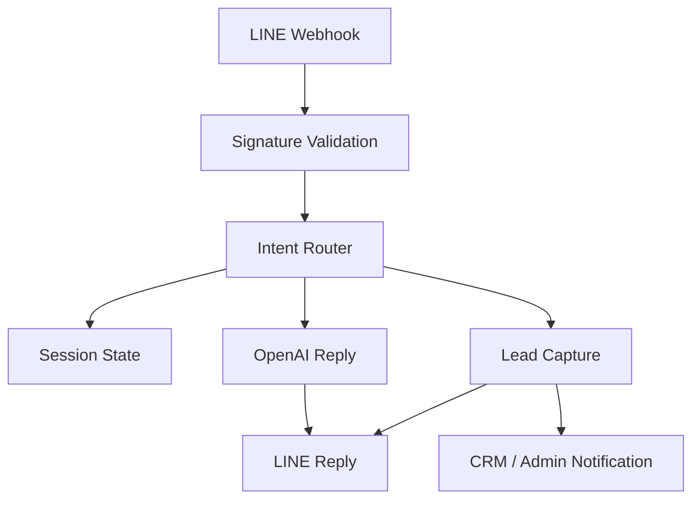
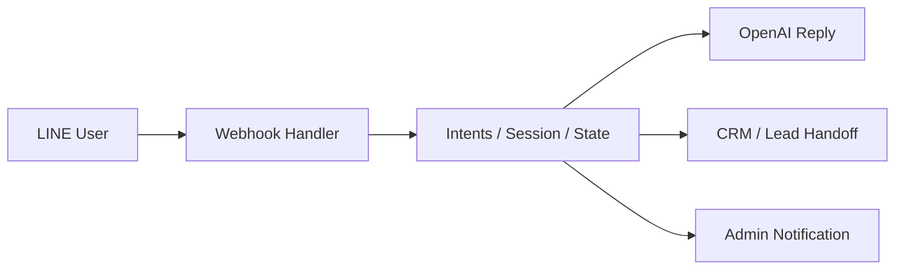

# 02_APPLICATION_INTELLIGENCE.md
### LINE Chatbot Application Intelligence
**Version:** 1.0  
**Effective Date:** 2026-06-26  
**Status:** Active  
**Authority:** Application Maintainers

---

## Executive Summary

This repository contains the LINE Chatbot AI application for the Jirawat financial advisory experience. The app is a Next.js 14 application that receives LINE webhook events, interprets user intent, manages a lead-capture conversation, and sends structured follow-up information to CRM and human handoff workflows.

The application is a consumer of AIOS principles and platform thinking. It is not the AIOS platform itself. Its role is to implement a channel-specific experience on top of shared governance and architecture expectations.

---

## Business Purpose

The application exists to provide a conversational assistant experience over LINE that can:

- answer common questions from a FAQ knowledge source
- capture lead information progressively
- detect purchase intent and product interest
- route qualified conversations to human follow-up
- send admin notifications for hot leads

The business logic is focused on advisory-style conversation, not open-ended generative chat.

---

## Business Flow

The application follows a practical conversation flow:

1. Receive webhook event from LINE
2. Verify request signature
3. Detect intent from text or rich menu action
4. Load or restore user session state
5. Capture lead data progressively
6. Route to FAQ answer, product flow, contact flow, or underwriting flow
7. Save state, update CRM, and notify admin when appropriate
8. Return the reply to the LINE user

This is a hybrid system: FAQ response + stateful lead capture + external CRM integration.

---

## Architecture

The application architecture is a server-based Next.js webhook application with a lightweight state machine and external integrations.

### Runtime model

- Next.js App Router
- Server route for LINE webhook
- In-process or KV-backed session persistence
- OpenAI chat completion for freeform response generation
- Google Sheets/App Script integration for CRM and FAQ data

---

## Technology Stack

- Next.js 14 with TypeScript
- LINE Messaging API SDK
- OpenAI API
- Vercel KV for session persistence
- Google Sheets / Apps Script for FAQ and CRM data
- Vercel for deployment

---

## Folder Responsibilities

### app/
Contains the Next.js application entry points and API route handlers.

- app/api/line-webhook/route.ts — main LINE webhook implementation
- app/page.tsx — minimal landing page for smoke testing

### lib/
Contains application runtime logic and integrations.

- openai.ts — OpenAI client, context history, timeout handling
- prompt.ts — system prompt assembly for AI reply behavior
- leadCapture.ts — lead extraction, field capture state machine, quick replies
- leadService.ts — CRM save orchestration and handoff logic
- session.ts — session persistence layer with KV fallback
- sheet.ts — FAQ retrieval from external CSV feed
- admin.ts — admin command handling
- adminNotify.ts — admin notification push logic
- scorer.ts — lead scoring heuristics
- richMessages.ts — structured LINE message content

### types/
Contains shared TypeScript definitions.

### __tests__/
Contains routing-focused regression tests for intent behavior.

---

## Application Runtime

The app is designed to run as a serverless webhook handler with a short max runtime. The current route is configured to support dynamic execution and a 30-second maximum duration.

Important operational characteristics:

- Each webhook request should be short-lived
- Session state is critical for multi-turn conversations
- External services can fail; the app should degrade gracefully
- The app is sensitive to cold starts and state loss

---

## AIOS Integration

This application is an AIOS consumer, not an AIOS implementation.

It reflects AIOS-aligned principles through:

- trust-first conversation behavior
- structured handoff instead of raw sales pressure
- separation of advisory logic from product-specific implementation details
- governance-aware lead capture and notification flows

However, the application currently does not expose a full AIOS registry or metadata-driven platform contract. It remains a channel-specific implementation that is conceptually aligned with the platform rather than fully integrated into the platform infrastructure.

---

## Features

### Implemented capabilities

- LINE webhook ingestion with signature validation
- FAQ-based conversational replies
- Product-interest detection
- Lead field capture for name, phone, age, gender, product, budget, and time preference
- Resume flow for interrupted conversations
- Admin commands such as #reset, #debug, #whoami, #help
- CRM upsert / handoff summary generation
- Admin hot-lead notifications
- Intent routing tests

### Missing or limited capabilities

- No formal platform registry integration
- No full AIOS artifact metadata contract
- No robust automated test suite beyond intent routing
- No full event-driven monitoring dashboard
- No strong separation between app logic and product content beyond current implementation boundaries

---

## Integrations

### LINE Messaging API
Used for inbound webhook events and outbound replies, quick replies, and rich menu actions.

### OpenAI API
Used to generate conversational responses with a constrained system prompt.

### Google Sheets / Apps Script
Used as an external FAQ source and CRM persistence layer.

### Vercel KV
Used as the preferred persistent session store, with in-memory fallback.

---

## Data Flow

1. Incoming LINE text or postback event reaches the webhook route
2. State is hydrated from session storage
3. Intent classification decides the next workflow
4. Lead data is accumulated from the ongoing conversation
5. The response is generated through OpenAI or from deterministic business logic
6. CRM data is saved and notifications may be emitted

The data flow is stateful and needs careful handling of retries, partial input, and session expiry.

---

## Conversation Flow

The current conversation model supports multiple modes:

- FAQ answer mode
- Premium quote flow
- Contact / handoff flow
- Underwriting-related review flow
- Resume / continuation flow

The router prioritizes user intent and state context to prevent incorrect flow switching.

---

## Deployment

The app is designed for deployment on Vercel with environment variables for:

- LINE credentials
- OpenAI API key
- Sheet CSV URL
- CRM Apps Script endpoint
- KV credentials
- Admin LINE user ID

Deployment is currently oriented around serverless functions and environment-based configuration.

---

## Configuration

The app relies on environment configuration from .env.example.

Key requirements include:

- LINE channel access token
- LINE channel secret
- OpenAI API key
- FAQ and CRM endpoints
- KV credentials for persistence
- admin routing configuration

---

## Known Technical Debt

The codebase shows several areas that require future hardening:

- In-memory state fallback is still used in some scenarios
- Session persistence is partially dependent on external services
- The app uses a large amount of imperative logic inside the webhook route
- Current tests are narrow and focused on routing heuristics
- Product/content constraints are embedded in code rather than in a more structured platform contract

---

## Known Bugs / Risks

The current codebase indicates the following operational risks:

- Session state can be lost on cold starts or when persistence is unavailable
- Some state transitions are still fragile when multiple intents compete
- External API failures may degrade the user experience
- CRM and notification integrations can fail silently without a strong recovery pattern

---

## Roadmap

Near-term priorities should focus on:

- stronger persistence and resilience
- more automated tests for end-to-end flows
- clearer separation between application and platform concerns
- broader AIOS compatibility and metadata alignment
- better observability and diagnostics

---

## Platform Assets vs Application Assets

### Platform Assets
These are shared concerns that should be treated as AIOS-level responsibilities:

- platform governance
- shared personas and workflow conventions
- metadata and registry models
- general architecture boundaries
- reusable AI intelligence patterns

### Application Assets
These are local to the LINE chatbot experience:

- LINE webhook route logic
- prompt definitions and channel-specific formatting
- local lead capture workflow implementation
- CRM and integration code
- conversation UX tuned for LINE

The distinction matters because the application should not silently become the owner of AIOS-level architecture.

---

## Application Boundaries

The application should not attempt to own:

- the AIOS product definition
- the platform governance model
- the global registry or metadata standard
- architectural principles that apply across all applications

It should focus on implementing a good experience within the platform contract.

---

## Architecture Diagrams

### High-level flow

---

## Developer Notes

When working on this app:

- understand the current conversation state before modifying routing logic
- preserve the existing handoff and CRM semantics
- avoid introducing app-specific logic that should live in the platform layer
- keep tests aligned with actual conversation behavior
- treat persistence and external failures as first-class concerns

---

## AI Handoff Guide

When another AI assistant begins work here, it should first understand:

The official entry point for repository context is AI_CONTEXT.md. For active collaboration, the temporary working memory should be reviewed in 90_AI_HANDOFF.md after the core intelligence documents. This keeps the handoff concise and aligned with the current task.

1. the AIOS product and platform context
2. the LINE application's business purpose
3. the current state machine and session behavior
4. the external integrations and failure modes
5. the current operational status before making architectural changes
